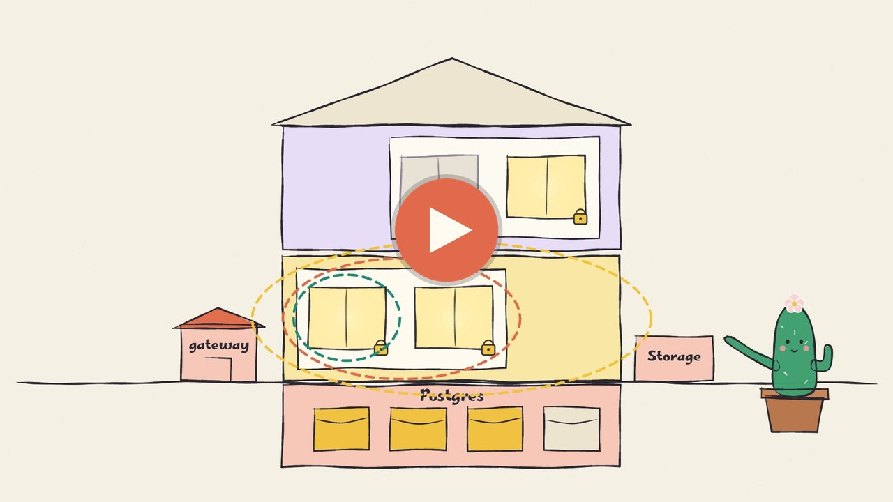

<p align="center"></p>

<h1 align="center">صباربيز</h1>

<p align="center" dir="rtl"><b>مشاريع Supabase كثيرة. خادم واحد.</b><br>Supabase الأصلي لكل عميل، على خادم تملكه.</p>

<p align="center" dir="rtl"><a href="README.md">English</a> · <a href="https://base.sbarah.com/">الموقع</a> · <a href="docs/README.ar.md">الوثائق</a> · <a href="docs/guides/quickstart.ar.md">البداية السريعة</a></p>

<p align="center" dir="rtl"><a href="https://base.sbarah.com/#explainer"></a><br><sub>دقيقة واحدة بصوت عربي: كيف يعمل صباربيز.</sub></p>

<div dir="rtl">

## ما هو

صباربيز طبقة مفتوحة المصدر تستضيفها بنفسك، تشغّل خدمات Supabase الأصلية (PostgreSQL وAuth وPostgREST وStorage) لمشاريع كثيرة على خادم واحد.

- **خادم عادي واحد.** لا تحتاج خادما ثانيا ولا خدمة سحابية. العملاء فيهم مشاريع، والمشاريع فيها بيئات (الإنتاج، التجربة).
- **لا تختلط البيانات.** لكل بيئة قاعدة بياناتها وحسابات دخولها ومفاتيحها. مفتاح مشروع لا يفتح مشروعا آخر أبدا.
- **سريع ويتسع للمزيد.** محرك PostgreSQL واحد وStorage واحد يخدمان كل البيئات، بدل نسخة Supabase كاملة لكل تطبيق، فيتسع الخادم نفسه لمشاريع أكثر.
- **المشروع المزدحم يبقى في حدوده.** لكل بيئة حصتها من الطلبات واتصالات قاعدة البيانات، وتعمل خدماتها بحدود خاصة بها من المعالج والذاكرة. الطلبات الزائدة يُطلب منها المحاولة بعد قليل، وتبقى المشاريع الأخرى سريعة.
- **تطبيقك لا يتغير.** يبقى على supabase-js وSQL.

## التثبيت

على خادم Fedora فارغ (خطّط لأربع أنوية و8 GB). كل خطوة مشروحة في [البداية السريعة](docs/guides/quickstart.ar.md).

</div>

```bash
sudo dnf install -y moby-engine git python3-cryptography && sudo systemctl enable --now docker
sudo useradd -m sbarbase && sudo usermod -aG docker sbarbase && sudo install -d -o sbarbase -g sbarbase /opt/sbarbase && sudo -u sbarbase git clone https://github.com/M7MMAD-OMAR/sbarbase /opt/sbarbase
sudo -u sbarbase -H bash -c 'curl -fsSL https://bun.sh/install | bash -s bun-v1.3.14'
cd /opt/sbarbase && sudo -u sbarbase /usr/bin/python3 lab/operator_file.py /home/sbarbase/operator.json
sudo deploy/server-acceptance.sh --rehearse --install-unit --first-project --service-user sbarbase --home /home/sbarbase --bun-dir /home/sbarbase/.bun/bin --bootstrap-file /home/sbarbase/operator.json
```

<div dir="rtl">

الأمر الأخير يثبّت الخدمة، وينشئ أول مشروع، ويتأكد أن supabase-js يعمل من خلاله، وأن الخدمة تعود بعد إعادة تشغيل الخادم.

## الوثائق

| | |
|---|---|
| [الشروح](docs/README.ar.md) | لماذا وُجد وكيف بُني، مع رسوم توضيحية |
| [الأدلة العملية](docs/README.ar.md) | البداية السريعة، اختيار خادم، الترقيات، النسخ الاحتياطي والاستعادة |
| [المرجع](docs/README.ar.md) | المسرد والإعدادات وواجهة API والحالة |
| [القرارات](docs/decisions/README.ar.md) | ما اخترناه وما رفضناه ولماذا |
| [الأمان](SECURITY.ar.md) · [المساهمة](CONTRIBUTING.ar.md) · [سجل التغييرات](CHANGELOG.ar.md) | |

كل صفحة موجهة للقارئ متوفرة بالعربية والإنجليزية، وفي أعلاها رابط إلى اللغة الأخرى.

## الحالة

قيد التطوير. نجح التثبيت في آلة افتراضية محلية، ولم يُجرَّب على خادم حقيقي بعد، وليس جاهزًا للإنتاج. ما يعمل، مع كل رقم، في [الحالة](docs/reference/status.ar.md).

## الترخيص

Apache-2.0. تحتفظ Supabase وPostgreSQL والاعتماديات الأخرى بتراخيصها.

</div>
