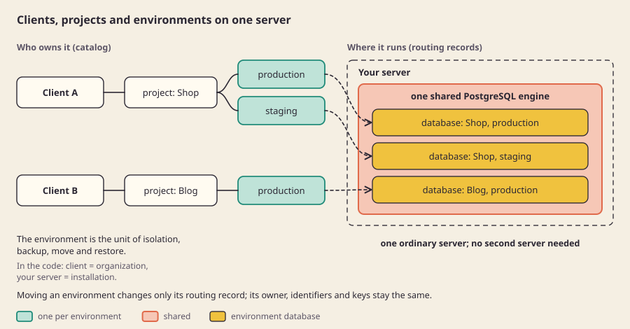

<p align="center"></p>

<h1 align="center">Sbarbase</h1>

<p align="center"><b>Many Supabase projects. One server.</b><br>Original Supabase for every client, on one machine you own.</p>

<p align="center"><a href="README.ar.md">العربية</a> · <a href="https://base.sbarah.com/en/">Website</a> · <a href="docs/README.md">Docs</a> · <a href="docs/guides/quickstart.md">Quickstart</a></p>

<p align="center"><a href="https://base.sbarah.com/en/#explainer"></a><br><sub>One minute, with voice: how Sbarbase works.</sub></p>

## What it is

Sbarbase is an open source, self-hosted layer that runs the original Supabase services (PostgreSQL, Auth, PostgREST, Storage) for many projects on one server.

- **One ordinary server.** No second machine and no cloud service needed. Clients hold projects, projects hold environments (production, staging).
- **No data mixing.** Each environment has its own database, its own logins and its own keys. A key from one project never opens another.
- **Fast, with room to grow.** One PostgreSQL engine and one Storage serve every environment, instead of a full Supabase stack per app, so the same server holds more projects.
- **A busy project stays in its lane.** Each environment gets its own share of requests and database connections, and its services run with their own CPU and memory limits. Extra requests are told to retry; the other projects stay fast.
- **Your app does not change.** It keeps using supabase-js and SQL.

<p align="center"></p>

## Install

On any Linux server with Docker, three commands ([Install with Docker](docs/guides/docker.md)):

```bash
git clone https://github.com/M7MMAD-OMAR/sbarbase /opt/sbarbase && cd /opt/sbarbase
docker compose up -d --build
docker compose exec sbarbase python3 lab/bootstrap.py
```

Without Docker Compose, on an empty Fedora server (plan on 4 cores and 8 GB). Each step is explained in the [quickstart](docs/guides/quickstart.md).

```bash
sudo dnf install -y moby-engine git python3-cryptography && sudo systemctl enable --now docker
sudo useradd -m sbarbase && sudo usermod -aG docker sbarbase && sudo install -d -o sbarbase -g sbarbase /opt/sbarbase && sudo -u sbarbase git clone https://github.com/M7MMAD-OMAR/sbarbase /opt/sbarbase
sudo -u sbarbase -H bash -c 'curl -fsSL https://bun.sh/install | bash -s bun-v1.3.14'
cd /opt/sbarbase && sudo -u sbarbase /usr/bin/python3 lab/operator_file.py /home/sbarbase/operator.json
sudo deploy/server-acceptance.sh --rehearse --install-unit --first-project --service-user sbarbase --home /home/sbarbase --bun-dir /home/sbarbase/.bun/bin --bootstrap-file /home/sbarbase/operator.json
```

The last command installs the service, creates a first project, proves supabase-js works through it and checks that the service comes back after a reboot.

## Documentation

| | |
|---|---|
| [Explanations](docs/README.md#explain-why-it-works-this-way) | why it exists and how it is built, with diagrams |
| [Guides](docs/README.md#guides-how-to-do-something) | quickstart, choosing a server, upgrades, backup and restore |
| [Reference](docs/README.md#reference-facts-to-look-up) | glossary, configuration, API, status |
| [Decisions](docs/decisions/README.md) | what was chosen, what was rejected, and why |
| [Security](SECURITY.md) · [Contributing](CONTRIBUTING.md) · [Changelog](CHANGELOG.md) | |

Every reader-facing page is in English and Arabic, with a link to the other language at the top.

## Status

In development. The install has passed in a local virtual machine, not yet on a real server, and it is not production ready. What works, with every number, is in [status](docs/reference/status.md).

## License

Apache-2.0. Supabase, PostgreSQL and other dependencies keep their own licenses.
