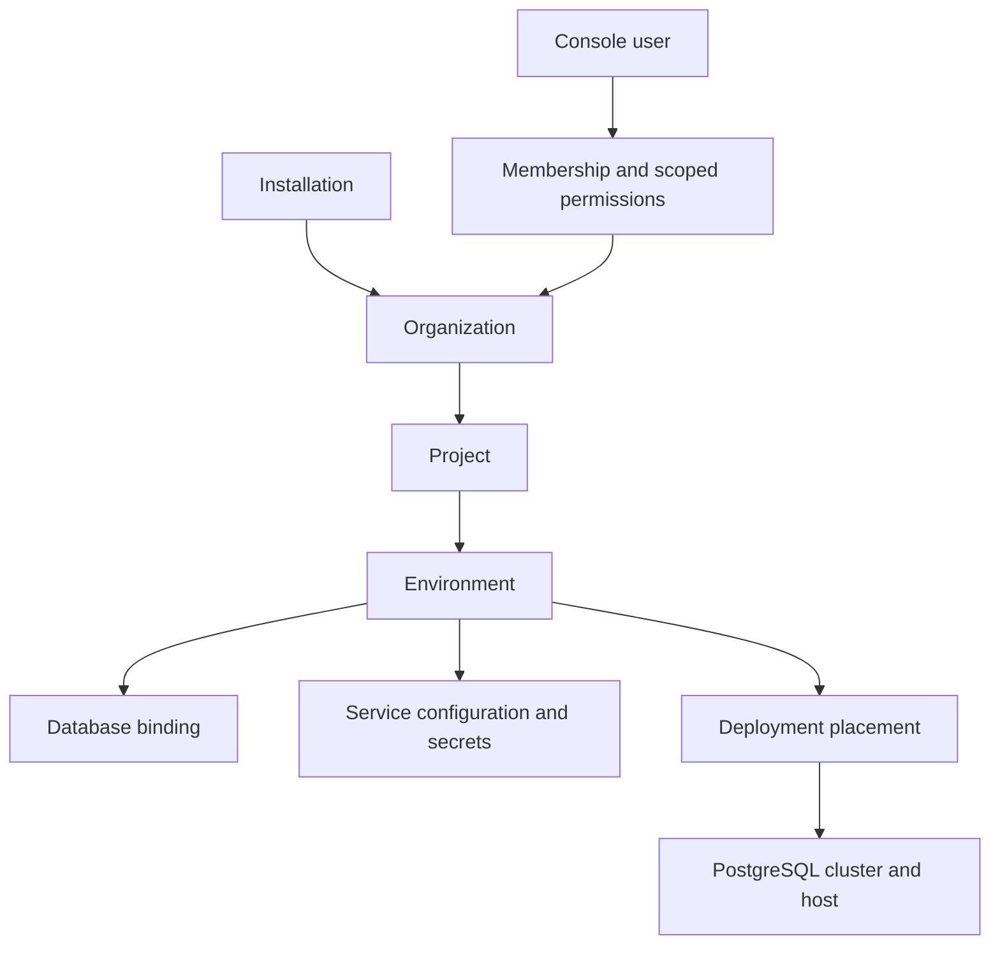

# Sbarbase foundation review

Date: 2026-09-20. Status: research and source review, not an implemented or approved production architecture.

## Product contract

Sbarbase is downloadable open source software. Each operator owns an independent installation and manages its own Supabase-based projects through a UI. Keeping Supabase is a firm user requirement. Replacing its APIs or auth system with a different backend is outside the current objective.

The objective is low incremental resource use and automatic management, without a full duplicated stack per project. Earlier responses incorrectly strengthened this into a ban on every per-project process. A few appropriately scoped services can be considered, but their resource cost must be measured. No reduction in resource usage has yet been demonstrated.

The default trust model is a trusted installation operator and untrusted public application users. A public hosting business with mutually hostile project owners would need a separately validated security profile. Being open source does not imply that deployment model.

## Findings that correct the conversation

1. Supabase already has a concrete cloud project model. Official documentation describes a dedicated PostgreSQL cluster for each project. The self-hosted package runs as one project and lacks the cloud organization/project management interface. We found no evidence that this is because Supabase could not discover a sound hierarchy. Do not infer product motives from missing features. [1][2]
2. Adding databases to PostgreSQL does not automatically produce fully integrated Supabase projects. Provisioning must configure service connections, roles, keys, migrations, storage, routing and management access together. [2]
3. Shared PostgreSQL plus database-per-environment is a candidate, not a settled conclusion. PostgreSQL roles are global to the cluster. Supabase's conventional role names and role-bearing JWTs create a compatibility task that database names alone cannot solve. [3]
4. One stock Auth or PostgREST instance cannot simply be configured to serve arbitrary separate project databases. That does not imply rewriting authentication. Per-environment instances can preserve the upstream services while the platform shares other infrastructure. On-demand startup is a later experiment, not a default requirement. [4][5]
5. Container count is not a capacity metric. Shared services still allocate per-environment pools and workers. PostgreSQL catalogs, connection backends, services and active subscriptions have different costs. See the capacity review.
6. Recovery, upgrades and secret management are part of the foundation. A database backup is not a complete installation backup, and a replica is not by itself a tested HA system. See the security and operations review.

## Domain hierarchy

Create one default organization and a production environment automatically. Additional organizations and environments are optional UI features. A project represents the product; an environment is its deployment and data boundary. Do not implement full database branching merely to offer a separate staging environment.

Infrastructure placement is independent of ownership: moving an environment to another cluster does not create a different business project. Console identities are separate from application identities. Organization-management permissions and access to production data must be explicit.

## Runtime options to compare

| Option | Benefit | Main limitation | Position |
| --- | --- | --- | --- |
| Shared PostgreSQL, separate database/roles and selected services per environment | Avoids repeated database engines and shares suitable infrastructure | Role/JWT/SQL compatibility and shared failure scope require proof | Primary candidate to prototype |
| Separate PostgreSQL instance per environment, with shared management and ingress | Keeps conventional role names local and narrows database failure scope | More baseline memory and operational work; still measure actual cost | Compatibility and isolation reference, fallback if shared cluster fails |
| Entire original stack per environment | Simple reference for upstream behavior | Duplicates services and conflicts with low-overhead objective | Benchmark reference only |
| Rewrite Auth or REST into new multi-database services | Potential process consolidation | High security, compatibility and maintenance burden | Not recommended |

Supabase remains the runtime foundation in both serious candidates. Do not adopt shared privileged database accounts across all environments as a shortcut. Ordinary end-user roles need RLS enforcement. Backend service roles may intentionally bypass application RLS, as in Supabase, but must remain environment-scoped and server-only.

## Sbarbase's own responsibility

Keep a small management application with explicit modules, rather than requiring distributed microservices or Kubernetes for the first release:

- Installation configuration, organizations, projects, environments and authorization.
- A durable operation record and reconciliation loop for provisioning, suspension, deletion, rotation and recovery.
- A restricted host agent for privileged work, isolated from the public data path.
- Desired and observed state, service versions, placement and encrypted secret references.
- Routing and per-environment admission limits.
- Backup, restore, upgrade preflight and diagnostic workflows.

Creation should progress through requested, provisioning, validating and ready, or failed with a safe retry. Concurrent retries must not create duplicate environments. A generation identifier prevents stale queued operations from acting on a deleted or replaced environment. Test crashes between each external operation and its completion record.

The control plane should configure service routes without being a synchronous dependency for every application request. Any cached configuration needs an explicit invalidation and revocation contract. Do not promise instant credential revocation without testing open connections, refresh tokens and queued work.

## Compatibility contract

Before choosing database topology, exercise a small existing-style supabase-js application against upstream and the candidate. Compare signup/login/refresh/logout, OAuth callback configuration, API keys, CRUD, RLS, RPC, SQL migrations, Realtime, Storage and functions. Include service-role semantics and direct PostgreSQL access. Feature support must be a published matrix tied to pinned component versions, not an unqualified '100% compatible' claim.

A critical test is importing SQL using `TO authenticated`, `auth.uid()` and `auth.role()`, with role claims and backend service keys, into two separate environments. If role names are translated, document the mapping and every compatibility difference. Test a compromised A authenticator credential against B; JWT rejection alone is not sufficient.

The feasibility review identifies two shared-cluster strategies. Namespaced API roles provide distinct identities but can break conventional SQL policies. Shared canonical NOLOGIN API roles can preserve those policies while unique service LOGIN roles enforce database entry, but global role attributes and memberships remain coupled. Neither is approved by this review. Evaluate explicit login/database HBA rules, CONNECT grants, pooler authentication and migration restrictions before selecting one. Independent clusters remain the reference when independent role administration is required.

## Existing implementations

The review found [supabase-multitenant](https://github.com/GustavoMartins123/supabase-multitenant), which describes shared PostgreSQL and selected infrastructure with per-project Auth, REST and Storage, and [Supafleet](https://github.com/arunrajiah/supafleet), which uses a similar core pattern. Their existence makes adaptation worth investigating before implementing lifecycle management from scratch. Neither was installed or certified.

Supafleet's inspected CLI provisioner reuses global database passwords and service login names across project containers. This expands credential compromise scope; it is a source-level concern, not a demonstrated exploit. The broader supabase-multitenant candidate includes patched components and a shared function runtime requiring their own review. Pigsty is a possible PostgreSQL operations foundation, while Coolify and Dokploy primarily manage deployments. Do not combine overlapping managers by default. Details and source links are in the alternatives review.

## Decision gates

1. Pin candidate component and community-project revisions. Inspect license files and included patches before incorporating code.
2. Build production and staging for A, and production for B. Validate lifecycle retries, routing and identity isolation through all enabled services.
3. Demonstrate ordinary upstream SDK behavior and explicitly report SQL/admin/API compatibility gaps.
4. Compare idle and active resource costs at 1 and 10 environments using the same realistic workload and hardware. Include a noisy environment and maintenance activity.
5. Restore an installation from off-host backups and restore A without changing B. Reconcile objects, auth state and scheduled side effects.
6. Rehearse a pinned component upgrade and a failure recovery. Do not advertise transparent rollback unless it is demonstrated after new writes.

Do not expand into multi-host HA or public hostile-tenant hosting before these gates establish the basic product. Single-host operation should clearly disclose its host-level failure scope.

## Review material

- [Capacity method](reviews/capacity-method.md)
- [Security and operations](reviews/security-operations.md)
- [Supabase feasibility](reviews/supabase-feasibility.md)
- [Existing implementations and product alternatives](reviews/alternatives-product.md)

## Sources

1. [Supabase self-hosted scope](https://supabase.com/docs/guides/self-hosting)
2. [Supabase project and database integration](https://supabase.com/docs/guides/troubleshooting/manually-created-databases-are-not-visible-in-the-supabase-dashboard-4415aa)
3. [PostgreSQL database and role boundaries](https://www.postgresql.org/docs/current/ddl-schemas.html)
4. [Supabase Auth inherited features](https://github.com/supabase/auth#inherited-features)
5. [PostgREST database configuration](https://docs.postgrest.org/en/stable/references/configuration.html#db-uri)
