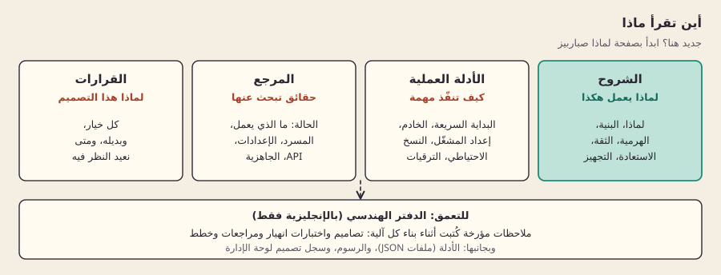

[English](README.md)

# وثائق صباربيز

صباربيز يشغّل مشاريع Supabase كثيرة على خادم واحد، تنسخها احتياطيًا وتستعيدها وترقّيها دون خوف. قسّمنا الوثائق بحسب ما تحتاجه الآن. ابدأ بصفحة [لماذا](explain/why.ar.md) إن كنت جديدًا، أو بصفحة [الحالة](reference/status.ar.md) إن أردت معرفة ما يعمل.

*أربعة أقسام، لكل منها غرض واحد، وتحتها الدفتر الهندسي.*

كلمات تتكرر في كل الصفحات: **العميل** (يسمّى منظمة في الكود) يملك **مشاريع**، ولكل مشروع **بيئات** مثل الإنتاج والتجربة. و"خادمك" هو ما يسمّيه الكود التثبيت. البيئة هي وحدة العزل والنقل والاستعادة. المصطلحات غير المألوفة في [المسرد](reference/glossary.ar.md).

## الشروح: لماذا يعمل بهذه الطريقة

اقرأ هذه الصفحات لتفهم التصميم. لكل صفحة الشكل نفسه: ما هو، ولماذا، وكيف بنيناه، وحدوده، وأين تتعمق أكثر.

- [لماذا صباربيز](explain/why.ar.md): المشكلة، والبدائل الموجودة، وما المختلف هنا.
- [البنية](explain/architecture.ar.md): مسار الطلب، وما هو مشترك وما هو منفصل.
- [الهرمية](explain/hierarchy.ar.md): العملاء والمشاريع والبيئات، ولماذا تنفصل الملكية عن مكان التشغيل.
- [العزل والثقة](explain/isolation-and-trust.ar.md): ما الذي يشكّل نقطة فشل مشتركة، ومن الموثوق.
- [نموذج التهديد](explain/threat-model.ar.md): الأصول، والمهاجمون، وحدود الثقة، والفحص وراء كل إجراء وقائي، والثغرات المعروفة.
- [الاستعادة](explain/recovery.ar.md): السياج، ثم التصدير، ثم الاستعادة، ثم التحقق، ثم التحويل.
- [التجهيز](explain/provisioning.ar.md): لماذا لا يؤدي الانهيار أبدًا إلى تنفيذ العمل مرتين.

## الأدلة العملية: كيف تنفّذ مهمة

- [التثبيت عبر Docker](guides/docker.ar.md): أقصر طريق، على أي خادم Linux عليه Docker.
- [البداية السريعة](guides/quickstart.ar.md): من خادم فارغ إلى استدعاء supabase-js، كما جُرّب في آلة افتراضية محلية.
- [اختيار خادم](guides/choosing-a-server.ar.md): ماذا تشتري، وماذا تعطيك الخيارات المجانية فعلًا.
- [المختبر المحلي](guides/local-lab.ar.md): شغّل الحزمة على جهازك لتقييمها.
- [إعداد المشغّل](guides/operator-setup.ar.md): أنشئ المشغّل الأول والعميل الأول.
- [النشر على خادم](guides/server-deployment.ar.md): دليل تشغيل الخادم وثغراته المعروفة.
- [إعدادات تسجيل الدخول](guides/sign-in.ar.md): عنوان الموقع وعناوين إعادة التوجيه ومزوّدو OAuth (Google وGitHub وApple وغيرها) لكل بيئة.
- [Supabase Studio](guides/studio.ar.md): افتح Studio الأصلي لبيئة واحدة، من خلف تسجيل الدخول إلى الواجهة.
- [النسخ الاحتياطي والاستعادة](guides/backup-and-restore.ar.md): الإجراء اليدوي المتاح اليوم.
- [الترقيات](guides/upgrades.ar.md): انقل التثبيت إلى إصدار أحدث، مع عودة تلقائية إن فشل.
- [الأمر sbarbase](guides/cli.ar.md): الحالة والنسخ الاحتياطية والاستعادة والبيئات والمفاتيح والترقية وStudio والسجلات من أمر واحد.

## المرجع: حقائق تبحث عنها

- [الحالة](reference/status.ar.md): المكان الوحيد لما يعمل ولكل رقم، مع التواريخ والأوامر.
- [المسرد](reference/glossary.ar.md): كل مصطلح داخلي في جملة أو جملتين.
- [الإعدادات](reference/configuration.ar.md): الملفات والخيارات ومتغيرات البيئة التي يتعامل معها المشغّل.
- [واجهة API](reference/api.ar.md): مسارات الإدارة والبوابة.
- [جاهزية النشر](reference/deployment-readiness.ar.md): مصفوفة جاهزية الخادم بندًا بندًا.

## القرارات

- [سجل القرارات](decisions/README.ar.md): كل اختيار، والبديل عنه، وشروط إعادة النظر فيه.

## الدفتر الهندسي

يضم [docs/engineering](engineering/README.md) الملاحظات المفصلة التي كُتبت أثناء بناء كل آلية: التصاميم، واختبارات الانهيار، والمراجعات، والخطط، و[نقاط التحقق](engineering/checkpoints.md) بترتيبها الزمني. هي دقيقة ومؤرخة، وبعضها حلّت محله ملاحظات لاحقة. اقرأها حين تحيلك إليها صفحة شرح، أو قبل أن تغيّر ذلك الجزء من النظام. ملاحظات الوكلاء البرمجيين الذين يكملون العمل في [engineering/handoff](engineering/handoff/README.md).

ونحتفظ هنا أيضًا بـ[الأدلة](evidence/) (ملفات JSON تكتبها الفحوص الحية وتستشهد بها صفحة الحالة)، و[الرسوم التوضيحية](diagrams/README.md)، و[سجل تصميم لوحة الإدارة](design/CONSOLE.ar.md).
