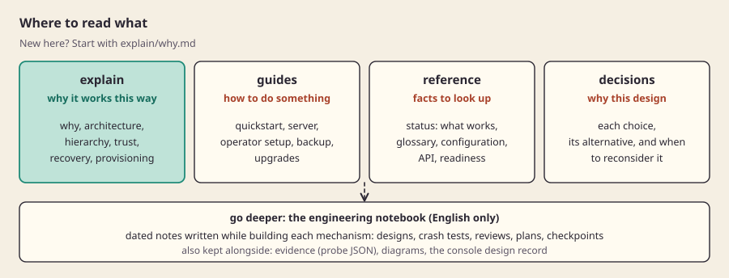

[العربية](README.ar.md)

# Sbarbase documentation

Sbarbase runs many Supabase projects on one server that you can back up, restore and upgrade without fear. The docs are split by what you need right now. Start with [why](explain/why.md) if you are new, or with [status](reference/status.md) if you want to know what works.

*Four sections, one purpose each, and the engineering notebook underneath.*

Words used throughout: a **client** (called an organization in the code) owns **projects**; each project has **environments** such as production and staging. "Your server" is what the code calls the installation. The environment is the unit of isolation, move and restore. Unfamiliar terms are in the [glossary](reference/glossary.md).

## Explain: why it works this way

Read these to understand the design. Each page has the same shape: what it is, why, how we built it, limits, and where to go deeper.

- [Why Sbarbase](explain/why.md): the problem, the existing alternatives and what is different here.
- [Architecture](explain/architecture.md): the request path and what is shared versus separate.
- [Hierarchy](explain/hierarchy.md): clients, projects and environments, and why ownership is separate from placement.
- [Isolation and trust](explain/isolation-and-trust.md): what is a shared failure boundary and who is trusted.
- [Threat model](explain/threat-model.md): assets, attackers, trust boundaries, the check behind each mitigation and the known gaps.
- [Recovery](explain/recovery.md): fence, export, restore, verify, switch.
- [Provisioning](explain/provisioning.md): why a crash never causes work to run twice.

## Guides: how to do something

- [Install with Docker](guides/docker.md): the shortest path, on any Linux host with Docker.
- [Quickstart](guides/quickstart.md): from an empty server to a supabase-js call, as rehearsed in a local VM.
- [Choosing a server](guides/choosing-a-server.md): what to buy, and what the free options really give you.
- [Local lab](guides/local-lab.md): run the stack on your own machine for evaluation.
- [Operator setup](guides/operator-setup.md): create the first operator and client.
- [Server deployment](guides/server-deployment.md): the server runbook and its known gaps.
- [Realtime](guides/realtime.md): database changes, broadcast and presence per environment.
- [Sign-in settings](guides/sign-in.md): site URL, redirect addresses and OAuth providers (Google, GitHub, Apple and others) per environment.
- [Supabase Studio](guides/studio.md): open the original Studio for one environment, behind the console login.
- [Backup and restore](guides/backup-and-restore.md): the manual procedure that exists today.
- [Upgrades](guides/upgrades.md): move an installation to a newer version, with an automatic way back.

## Reference: facts to look up

- [Status](reference/status.md): the single place for what works and every number, with dates and commands.
- [Glossary](reference/glossary.md): every internal term in one or two sentences.
- [Configuration](reference/configuration.md): files, flags and environment variables an operator touches.
- [API](reference/api.md): management and gateway routes.
- [Deployment readiness](reference/deployment-readiness.md): the itemised server readiness matrix.

## Decisions

- [Decision register](decisions/README.md): each choice, the alternative and the conditions for reconsidering it.

## Engineering notebook

[docs/engineering](engineering/README.md) holds the detailed notes written while building each mechanism: designs, crash tests, reviews, plans and the chronological [checkpoints](engineering/checkpoints.md). They are precise and dated, and some are superseded by later notes. Read them when an explain page links you there or before changing that subsystem. Notes for coding agents continuing the work are in [engineering/handoff](engineering/handoff/README.md).

Also kept here: [evidence](evidence/) (JSON written by live probes, cited by status), [diagrams](diagrams/README.md) and the [console design record](design/CONSOLE.md).
