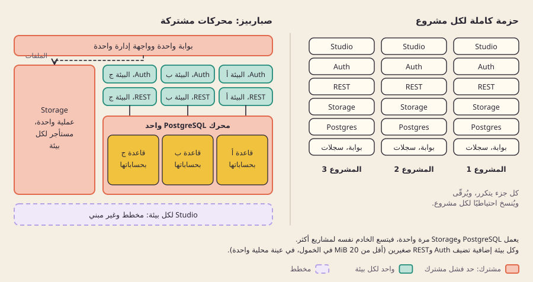
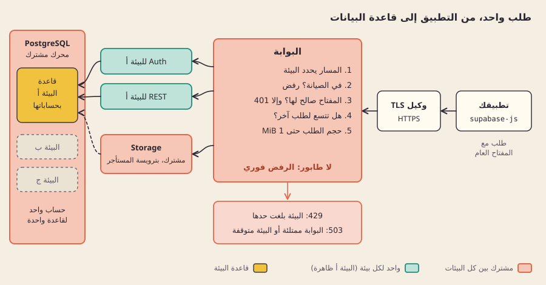
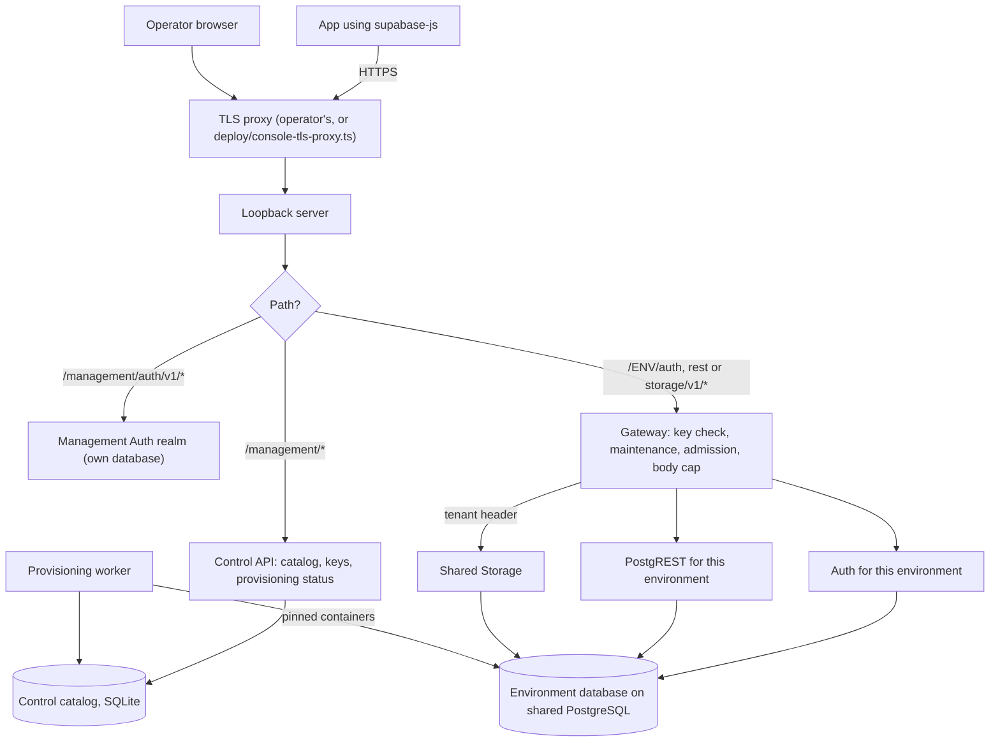

[English](architecture.md)

# البنية

## ما هي

بوابة واحدة على خادمك تستقبل كل طلب، وتتحقق من مفتاح API، ثم تمرّره إلى خدمة Supabase الأصلية في البيئة الصحيحة. لكل بيئة قاعدة بياناتها وAuth وREST خاصة بها؛ أما PostgreSQL نفسه وStorage فعمليتان مشتركتان.

## لماذا

الخيار هو مشاركة المحركات الثقيلة (PostgreSQL وStorage)، وفصل الخدمات التي تحمل هوية البيئة وواجهتها البرمجية (Auth وPostgREST وقاعدة البيانات وحسابات دخولها). Auth وPostgREST خدمتان صغيرتان، وتشغيلهما لكل بيئة يعني ألا تبديل لقاعدة البيانات لحظة الطلب، ولا نسخة معدّلة (fork) من أيٍّ منهما.

بدائل مرفوضة:

- **Auth واحد وPostgREST واحد لكل البيئات**، مع تبديل قاعدة البيانات في كل طلب. لا تدعم أيٌّ من الخدمتين الأصليتين هذا نمطًا معتمدًا، وجعله يعمل يعني إعادة كتابة كود حساس أمنيًا.
- **حزمة كاملة لكل بيئة.** أبقيناها أساسًا لقياس العزل وخيارًا احتياطيًا (PostgreSQL مستقل لكل بيئة)، لكنها تكرر كل المكوّنات.

## كيف بنيناه

*يعمل PostgreSQL وStorage مرة واحدة، وتضيف كل بيئة قاعدتها ومستأجر Storage وAuth وREST صغيرين خاصين بها.*

*تفحص البوابة كل طلب مقابل البيئة المذكورة في مساره، وترفض بدل أن تضعه في طابور.*

هذا التوجيه الكامل نصًا، بما فيه مسار الإدارة وعامل التجهيز:

**مسار الطلب.** يستدعي التطبيق `/<environment>/rest/v1/...` بمفتاحه العام. تقرأ البوابة سجل توجيه البيئة (هل هي في الصيانة؟ وأين تعمل؟)، وتطابق المفتاح مع البصمات المحفوظة، وتقبل الطلب إن كان عدد الطلبات الجارية للبيئة دون حدها المتزامن، وتحدّ الجسم بـ1 MiB (أما رفع ملف إلى Storage فيمر كما يصل حتى حد الرفع، 50 MiB افتراضيًا)، ثم تمرّره إلى PostgREST الخاص بتلك البيئة. طلبات Storage تذهب إلى عملية Storage المشتركة الوحيدة، مع ترويسة مستأجر موثوقة تسمّي البيئة. تنزيلات Storage العامة والموقّعة هي وحدها الطلبات المسموحة بلا مفتاح API.

**مسار الإدارة.** يسجّل المشغّلون دخولهم عبر نطاق إدارة مخصص في Auth، لا يكون أبدًا Auth الخاصة ببيئة تطبيق. تستخرج واجهة التحكم هوية الفاعل من هذا الدخول، لا من جسم الطلب أبدًا، وتطبّق أدوار المالك والمدير والمشاهد.

**حدود الثقة.** وكيل TLS وحده يواجه الشبكة؛ والخادم المحلي (loopback) وكل حاوية خلفه تستمع على loopback أو على شبكات Docker داخلية، بلا منافذ منشورة. حركة التطبيقات لا تدخل إلا عبر البوابة وتحتاج إلى مفتاح عام؛ وحركة المشغّلين لا تمر إلا عبر نطاق الإدارة المنفصل وواجهة التحكم. مشغّلو الخادم موثوقون، وزوار التطبيقات غير موثوقين. ما يعنيه ذلك للمكوّنات المشتركة مشروح في [العزل والثقة](isolation-and-trust.ar.md).

**العمل في الخلفية.** إنشاء بيئة يضع مهمة في الطابور. عامل تجهيز واحد، يمسك قفلًا حصريًا، ينشئ قاعدة البيانات وحسابات الدخول المحصورة، ويكتب قواعد الاتصال، ويشغّل الخدمات. انظر [التجهيز](provisioning.ar.md).

| مشترك | منفصل لكل بيئة |
|---|---|
| محرك PostgreSQL (عنقود واحد) | قاعدة البيانات، وثلاثة حسابات دخول محصورة للخدمات، وقواعد الاتصال |
| عملية Storage | مستأجر Storage ومفاتيح توقيعه وبياناته الوصفية |
| البوابة وواجهة التحكم | Auth وPostgREST والمفاتيح العامة وسجل التوجيه |
| معالج الخادم وذاكرته وقرصه | حدود فئة الموارد لكل حاوية |

الكود: [src/control/application.ts](../../src/control/application.ts) (التوجيه بين المسارات الثلاثة)، و[src/gateway/handler.ts](../../src/gateway/handler.ts) و[src/gateway/managed.ts](../../src/gateway/managed.ts) (البوابة)، و[src/gateway/concurrency.ts](../../src/gateway/concurrency.ts) (القبول)، و[src/control/http.ts](../../src/control/http.ts) و[src/control/key-http.ts](../../src/control/key-http.ts) (واجهة الإدارة)، و[src/control/catalog.ts](../../src/control/catalog.ts) (الفهرس)، و[lab/worker.py](../../lab/worker.py) و[lab/durable_runtime.py](../../lab/durable_runtime.py) (بيئة التشغيل). المسارات مسرودة في [مرجع API](../reference/api.ar.md).

## الحدود

- القبول لكل عملية بوابة، بلا طابور: البيئة المثقلة تأخذ `429`، والخادم المشغول يأخذ `503`. عمليات البوابة المتعددة لا تتشارك العدّادات.
- يمر رفع الملفات كما يصل حتى حد الرفع (50 MiB افتراضيًا)؛ والرفع القابل للاستئناف (TUS) لا يُوجَّه بعد.
- يعمل Realtime وEdge Functions في حاوية لكل بيئة تشغّلهما، ويعمل Studio لكل بيئة عند الطلب. أما مجمّع الاتصالات (pooler) وcron فلم يدخلا بعدُ في البنية العاملة.
- كل العمليات تتشارك فهرسًا محليًا واحدًا؛ ولا تنسيق بين عدة خوادم.

## للتعمق

- [طبقة التحكم](../engineering/CONTROL-PLANE.md)، و[التوجيه الدائم](../engineering/PERSISTENT-ROUTING.md)، و[حمل البوابة الزائد](../engineering/GATEWAY-OVERLOAD.md)، و[تصريف البوابة](../engineering/GATEWAY-DRAIN.md).
- [بيئة التشغيل المشتركة](../engineering/COMBINED-RUNTIME.md) و[سياسة الموارد](../engineering/RESOURCE-POLICY.md).
- [مواصفة دمج Studio](../engineering/STUDIO-INTEGRATION.md): كيف ستحصل كل بيئة على Studio أصلي خاص بها.
