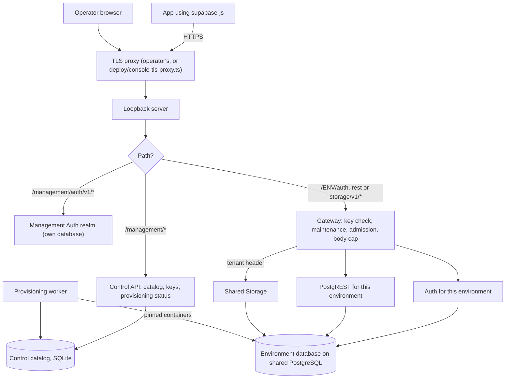

# Architecture

## What it is

One gateway on your server receives every request, checks the API key and forwards it to the original Supabase service of the right environment. Each environment has its own database, Auth and REST; PostgreSQL itself and Storage are shared processes.

## Why

The choice is to share the heavy engines (PostgreSQL, Storage) and keep separate the services that hold an environment's identity and API surface (Auth, PostgREST, the database and its logins). Auth and PostgREST are small, and running them per environment means no request-time database switching and no fork of either service.

Rejected alternatives:

- **One Auth and one PostgREST for all environments**, switching database per request. Neither upstream service supports that as an established mode, and making it work means rewriting security-critical code.
- **A full stack per environment.** Kept as the isolation baseline and the fallback (independent PostgreSQL per environment), but it repeats every component.

## How we built it

**Request path.** An app calls `/<environment>/rest/v1/...` with its publishable key. The gateway reads the environment's routing record (is it in maintenance? where does it live?), verifies the key against stored hashes, admits the request if the environment has fewer than its concurrent limit in flight, caps the body at 1 MiB and forwards it to that environment's own PostgREST. Storage requests go to the one shared Storage process with a trusted tenant header naming the environment. Public and signed Storage downloads are the only requests allowed without an API key.

**Management path.** Operators log in against a dedicated management Auth realm that is never an application environment's Auth. The control API derives the actor from that login, never from the request body, and applies owner, admin and viewer roles.

**Trust boundary.** Only the TLS proxy faces the network; the loopback server and every container behind it listen on loopback or internal Docker networks, with no published ports. App traffic enters only through the gateway and needs a publishable key; operator traffic goes only through the separate management realm and the control API. The server's operators are trusted, the visitors of the apps are not. What that means for shared components is in [isolation and trust](isolation-and-trust.md).

**Background work.** Creating an environment queues a job. A single provisioning worker, holding an exclusive lock, creates the database and scoped logins, writes the connection rules and starts the services. See [provisioning](provisioning.md).

| Shared | Separate per environment |
|---|---|
| PostgreSQL engine (one cluster) | Database, three scoped service logins, connection rules |
| Storage process | Storage tenant, its signing keys and metadata |
| Gateway and control API | Auth, PostgREST, publishable keys, routing record |
| Host CPU, memory, disk | Resource tier limits per container |

Code: [src/control/application.ts](../../src/control/application.ts) (routing between the three paths), [src/gateway/handler.ts](../../src/gateway/handler.ts) and [src/gateway/managed.ts](../../src/gateway/managed.ts) (gateway), [src/gateway/concurrency.ts](../../src/gateway/concurrency.ts) (admission), [src/control/http.ts](../../src/control/http.ts) and [src/control/key-http.ts](../../src/control/key-http.ts) (management API), [src/control/catalog.ts](../../src/control/catalog.ts) (catalog), [lab/worker.py](../../lab/worker.py) and [lab/durable_runtime.py](../../lab/durable_runtime.py) (runtime). Routes are listed in the [API reference](../reference/api.md).

## Limits

- Admission is per gateway process, with no queue: an overloaded environment gets `429` and a busy server `503`. Several gateway processes do not share counts.
- Uploads are buffered up to 1 MiB; large and resumable uploads, browser CORS and OAuth providers are not finished.
- Realtime, Edge Functions, the pooler, cron and per-environment Studio are not part of the running architecture yet.
- All processes share one local catalog; there is no multi-server coordination.

## Go deeper

- [Control plane](../engineering/CONTROL-PLANE.md), [persistent routing](../engineering/PERSISTENT-ROUTING.md), [gateway overload](../engineering/GATEWAY-OVERLOAD.md), [gateway drain](../engineering/GATEWAY-DRAIN.md).
- [Combined runtime](../engineering/COMBINED-RUNTIME.md) and [resource policy](../engineering/RESOURCE-POLICY.md).
- [Studio integration specification](../engineering/STUDIO-INTEGRATION.md): how each environment will get its own upstream Studio.
