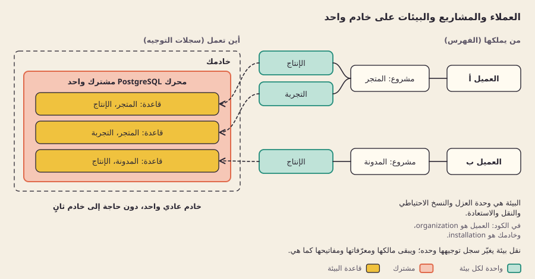

[English](hierarchy.md)

# الهرمية

## ما هي

على خادمك عملاء، وكل عميل يملك مشاريع، ولكل مشروع بيئات مثل الإنتاج والتجربة. مالك البيئة (العميل) يُسجَّل منفصلًا عن مكان عملها (مكان التشغيل)، فتنتقل البيئة دون أن يتغير مالكها.

## لماذا

**الخيار: الملكية منفصلة عن مكان التشغيل.** يحفظ الفهرس سلسلة الملكية (عميل > مشروع > بيئة) في موضع واحد، ويحفظ مكان تشغيل كل بيئة في سجل توجيه منفصل. نقل بيئة إلى محرك قاعدة بيانات مستعاد لا يغيّر إلا سجل توجيهها؛ وتبقى معرّفاتها ومفاتيحها ومالكها كما هي. ونقل ملكية مشروع إلى عميل آخر لا يغيّر إلا بيانات الملكية الوصفية، ولا يتحرك شيء.

**بديل مرفوض: ربط العميل بخادم.** لو كان على مشاريع العميل أن تعيش في مكان العميل نفسه، لصار توزيع الحمل أو استعادة بيئة واحدة في مكان آخر يعني إعادة إنشاء الملكية والمفاتيح والعضويات. وسحابة Supabase المُدارة وحزمتها المستضافة ذاتيًا تحددان نطاق هذه الأشياء كلٌّ بطريقة، فلا ينسخ صباربيز أيًا منهما.

**لماذا البيئة هي الوحدة لا المشروع.** لإنتاج المشروع الواحد وتجربته بيانات وبيانات اعتماد ومفاتيح منفصلة. لذلك يعمل العزل والنسخ الاحتياطي والنقل والاستعادة على بيئة واحدة في كل مرة.

## كيف بنيناه

*الملكية محفوظة في الفهرس، ومكان تشغيل كل بيئة سجل توجيه على خادم عادي واحد.*

المشغّلون أعضاء في عميل بأحد ثلاثة أدوار:

| الدور | قراءة المشاريع | إنشاء المشاريع والبيئات | إدارة المفاتيح | إدارة الأعضاء |
|---|---|---|---|---|
| مالك | نعم | نعم | نعم | نعم، مع بقاء مالك واحد على الأقل |
| مدير | نعم | نعم | نعم | لا |
| مشاهد | نعم | لا | لا | لا |

كل تعديل يتحقق من الصلاحية ويكتب التغيير في معاملة واحدة على قاعدة البيانات، مع صف تدقيق. تغييرات مكان التشغيل تحمل رقم مراجعة، فلا يستطيع طرف متأخر أن يكتب فوق قرار أحدث.

الكود: [src/control/catalog.ts](../../src/control/catalog.ts) (العملاء والمشاريع والبيئات والعضويات والمهام)، [src/control/placement.ts](../../src/control/placement.ts) (التوجيه مع مكان التشغيل)، [src/control/keys.ts](../../src/control/keys.ts) (بيانات المفاتيح الوصفية المحفوظة ببصمتها). العميل في الكود اسمه `organization`، وخادمك اسمه `installation`.

## الحدود

- نقل ملكية مشروع بين العملاء يغيّر البيانات الوصفية فقط. لا يلغي المفاتيح الصادرة ولا ينهي الجلسات ولا يدوّر بيانات اعتماد قاعدة البيانات، وليس معروضًا ميزةً مكتملة.
- لا توجد دعوات بعد؛ أول مالك يُنشأ بأمر إعداد محلي.
- مكان التشغيل محصور في خادم واحد. الخادم الثاني عمل مستقبلي، ولا تنسيق بين عدة خوادم.
- صفوف التدقيق سجلات محلية، لا سجل محمي من العبث.

## للتعمق

- [طبقة التحكم](../engineering/CONTROL-PLANE.md): الأدوار والمعاملات وحدود نقل الملكية.
- [التوجيه الدائم](../engineering/PERSISTENT-ROUTING.md): علامة الصيانة وأرقام المراجعة ومكان التشغيل.
- [سجل القرارات](../decisions/README.ar.md): قرار الهرمية وبدائله.
