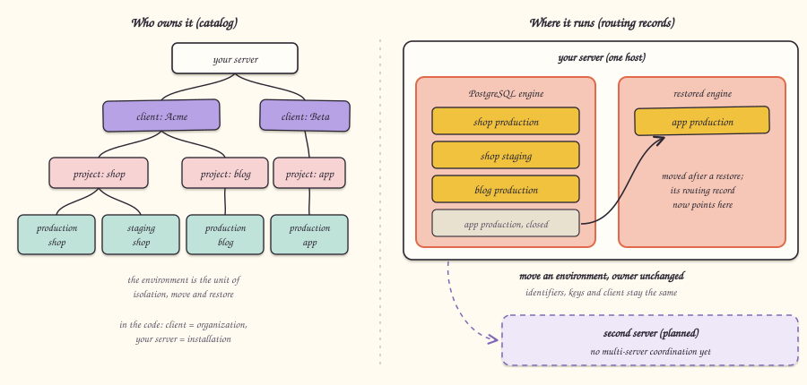

[العربية](hierarchy.ar.md)

# Hierarchy

## What it is

Your server holds clients, each client owns projects, and each project has environments such as production and staging. Who owns an environment (the client) is recorded separately from where it runs (the placement), so an environment can move without changing its owner.

## Why

**Choice: ownership separate from placement.** The catalog stores the ownership chain (client > project > environment) in one place and the runtime placement of each environment in a separate routing record. Moving an environment to a restored database engine changes only its routing record; its identifiers, keys and owner stay the same. Transferring a project to another client changes only ownership metadata; nothing is moved.

**Rejected alternative: tie a client to a server.** If a client's projects had to live where the client lives, balancing load or restoring one environment elsewhere would mean re-creating ownership, keys and memberships. Supabase's managed cloud and its self-hosted package also scope these things differently, so Sbarbase does not copy either.

**Why the environment, not the project, is the unit.** Production and staging of the same project have separate data, credentials and keys. Isolation, backup, move and restore therefore operate on one environment at a time.

## How we built it

Operators are members of a client with one of three roles:

| Role | Read projects | Create projects and environments | Manage keys | Manage members |
|---|---|---|---|---|
| Owner | yes | yes | yes | yes, keeping at least one owner |
| Admin | yes | yes | yes | no |
| Viewer | yes | no | no | no |

Every mutation checks authority and writes the change in one database transaction, with an audit row. Placement changes use a revision number, so a stale caller cannot overwrite a newer decision.

Code: [src/control/catalog.ts](../../src/control/catalog.ts) (clients, projects, environments, memberships, jobs), [src/control/placement.ts](../../src/control/placement.ts) (routing with placement), [src/control/keys.ts](../../src/control/keys.ts) (hashed key metadata). In the code a client is an `organization` and your server is the `installation`.

## Limits

- Transferring a project between clients changes metadata only. It does not revoke issued keys, end sessions or rotate database credentials, and it is not exposed as a finished feature.
- There are no invitations yet; the first owner is created by a local setup command.
- Placement is on one server. A second server is future work, and there is no multi-server coordination.
- Audit rows are local records, not a tamper-proof log.

## Go deeper

- [Control plane](../engineering/CONTROL-PLANE.md): roles, transactions and transfer limits.
- [Persistent routing](../engineering/PERSISTENT-ROUTING.md): maintenance flag, revisions and placement.
- [Decision register](../decisions/README.md): the hierarchy decision and its alternatives.
