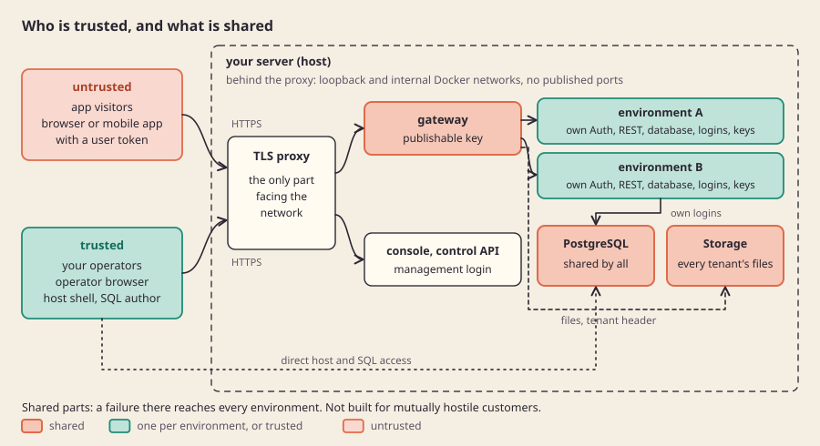

[English](isolation-and-trust.md)

# العزل والثقة

## ما هو

لكل بيئة قاعدة بياناتها وحسابات دخول خدماتها ومفاتيحها، فلا يصل مستخدمو تطبيق ورموزهم إلى بيئة أخرى. بعض الأجزاء مشتركة عمدًا: محرك PostgreSQL وStorage والبوابة والخادم نفسه. وكل جزء مشترك موضع يستطيع فيه عطل بيئة واحدة أن يصيب غيرها.

## لماذا

**الخيار: المشغّلون موثوقون، وزوار التطبيقات ليسوا كذلك.** من يدير الخادم ويكتب SQL لبيئاته موثوق. أما زوار التطبيقات، برموزهم المجهولة أو رموز الدخول، فغير موثوقين. يناسب ذلك المستخدم الأساسي، وهو مطوّر واحد أو وكالة تشغّل تطبيقات لعملائها، ويُبقي التصميم صادقًا فيما يحمي منه فعلًا.

**البديل المرفوض: استضافة مشتركة لعملاء لا يثق بعضهم ببعض.** بيع المساحة لهم يتطلب عزلًا عن المشغّل نفسه وعن أي SQL يُكتب، ولا يقدر محرك PostgreSQL مشترك على ذلك. من يحتاج هذا المستوى فليشغّل نسخًا مستقلة كاملة.

**الخيار: بيانات اعتماد منفصلة، لا مخططات منفصلة فقط.** الفصل بالمخططات داخل قاعدة واحدة يترك كل البيئات خلف Auth واحد وأدوار API واحدة. أما قاعدة لكل بيئة، بحسابات دخولها وقواعد اتصال لا تسمح إلا لحساب واحد بالوصول إلى قاعدة واحدة، فتُبقي أي سر خدمة مسرّب داخل بيئته.

## كيف بنيناه

ما يخص كل بيئة وحدها:

- قاعدة بيانات لا تمنح صلاحية `CONNECT` إلا لحسابات دخولها، وقواعد اتصال تسمّي أزواجًا دقيقة من الحساب والقاعدة. هذه القواعد في ملف المصادقة حسب المضيف في PostgreSQL، أي HBA.
- ثلاثة حسابات دخول محصورة لخدمات Auth وREST وStorage، بكلمات مرور مولّدة.
- سر توقيع Auth خاص بها، ومفاتيح عامة خاصة بها لا يُحفظ منها إلا بصماتها، ومستأجر Storage ومفاتيح توقيع خاصة بها.
- سجل توجيه يستطيع وضع البيئة في الصيانة دون المساس بغيرها.

ما هو مشترك، ولذلك حدّ فشل مشترك:

- **محرك PostgreSQL.** انهياره أو امتلاء قرصه أو قفل طويل فيه يصيب كل البيئات عليه. أدوار API القياسية (`anon` و`authenticated` و`service_role`) موجودة مرة واحدة في كل محرك، لأن أدوار PostgreSQL تشمل العنقود كله.
- **عملية Storage.** تحمل إعدادات كل المستأجرين، واختراقها اختراق لملفات المستأجرين جميعًا.
- **البوابة وفهرس التحكم.** إذا توقفا، توقفت كل البيئات عن الرد.
- **الخادم.** المعالج والذاكرة والقرص والإدخال والإخراج مشتركة. كل حاوية تعمل ضمن فئة موارد لها وزن معالج وحدود إدخال وإخراج لكل جهاز، وتُرفض البيئات الجديدة إذا نقصت الذاكرة أو القرص، أو ارتفع ضغط cgroup، أو ضاقت ميزانية الاتصالات.

الكود: [lab/resource_policy.py](../../lab/resource_policy.py) (الفئات)، و[lab/resource_admission.py](../../lab/resource_admission.py) و[lab/pressure_admission.py](../../lab/pressure_admission.py) و[lab/connection_budget.py](../../lab/connection_budget.py) (القبول)، و[lab/hba_authority.py](../../lab/hba_authority.py) (قواعد الاتصال)، و[src/gateway/handler.ts](../../src/gateway/handler.ts) (فحص المفاتيح).

## الحدود

- لا يوفّر صباربيز عزلًا عن مشغّل خادم معادٍ، ولا عن SQL عشوائي يشغّله كاتب موثوق.
- فئات الموارد مضبوطة في الإعدادات، لكنها لم تُعايَر تحت حمل متواصل؛ ما زال الجار المزعج قادرًا على إبطاء غيره.
- إعادة تحميل قواعد الاتصال لا تُنهي الجلسات المفتوحة من قبل.
- استرشد التصميم بعدة مراجعات هجومية، وهي ليست شهادة أمان.

## للتعمق

- [نموذج التهديد](threat-model.ar.md): الأصول والأطراف وحدود الثقة، والأدلة وراء كل إجراء حماية، والثغرات المعروفة.
- [مراجعة الأمان والتشغيل](../engineering/reviews/security-operations.md).
- [سياسة الموارد](../engineering/RESOURCE-POLICY.md)، و[قبول الموارد](../engineering/RESOURCE-ADMISSION.md)، و[قبول الضغط](../engineering/PRESSURE-ADMISSION.md)، و[ميزانية الاتصالات](../engineering/CONNECTION-BUDGET.md)، و[الجار المزعج](../engineering/NOISY-NEIGHBOR.md).
- [مراجعة Storage المشترك](../engineering/reviews/shared-storage.md) و[الاستبدال الذري لملف HBA](../engineering/ATOMIC-HBA-REPLACEMENT.md).
