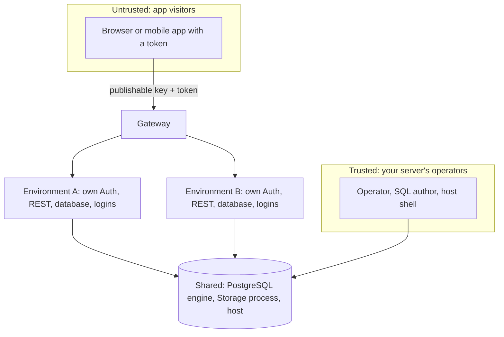

# Isolation and trust

## What it is

Each environment gets its own database, its own service logins and its own keys, so an app's users and tokens cannot reach another environment. Some parts are deliberately shared (the PostgreSQL engine, Storage, the gateway and the host), and anything shared is a place where one environment's failure can affect the others.

## Why

**Choice: trusted operators, untrusted app visitors.** The people who run the server and write SQL for its environments are trusted. The visitors of the apps, with their anonymous or signed-in tokens, are not. This matches the primary user (one developer or agency running apps for their own clients) and keeps the design honest about what it defends against.

**Rejected alternative: hostile multi-tenant hosting.** Selling space to mutually hostile customers would require isolation from the operator and from arbitrary SQL, which a shared PostgreSQL engine cannot give. Anyone who needs that should run independent stacks.

**Choice: separate credentials, not only separate schemas.** Separation by schema inside one database would leave every environment behind the same Auth and the same API roles. A database per environment, with its own logins and connection rules that allow exactly one login to reach exactly one database, keeps a leaked service credential inside its environment.

## How we built it

What is separate per environment:

- A database with `CONNECT` granted only to its own logins, and connection rules (the PostgreSQL host-based authentication file, HBA) naming exact login and database pairs.
- Three scoped service logins for Auth, REST and Storage, with generated passwords.
- Its own Auth signing secret, its own publishable keys (stored only as hashes), and its own Storage tenant and signing keys.
- A routing record that can put the environment in maintenance without touching the others.

What is shared, and therefore a shared failure boundary:

- **The PostgreSQL engine.** A crash, a full disk or a long lock affects every environment on it. The canonical API roles (`anon`, `authenticated`, `service_role`) exist once per engine, because PostgreSQL roles are cluster-wide.
- **The Storage process.** It holds every tenant's configuration; a compromise of that process is a compromise of all tenants' files.
- **The gateway and control catalog.** If they stop, every environment stops answering.
- **The host.** CPU, memory, disk and IO are shared. Each container runs under a resource tier with CPU weight and per-device IO limits, and new environments are refused when memory, disk, cgroup pressure or connection budgets are short.

Code: [lab/resource_policy.py](../../lab/resource_policy.py) (tiers), [lab/resource_admission.py](../../lab/resource_admission.py), [lab/pressure_admission.py](../../lab/pressure_admission.py) and [lab/connection_budget.py](../../lab/connection_budget.py) (admission), [lab/hba_authority.py](../../lab/hba_authority.py) (connection rules), [src/gateway/handler.ts](../../src/gateway/handler.ts) (key checks).

## Limits

- Isolation from a hostile server operator or from arbitrary SQL run by a trusted author is not provided.
- Resource tiers are configured, not calibrated under sustained load; a noisy neighbour can still slow the others.
- Reloading connection rules does not end sessions that were already open.
- Multiple adversarial reviews informed the design; they are not a security certification.

## Go deeper

- [Security and operations review](../engineering/reviews/security-operations.md).
- [Resource policy](../engineering/RESOURCE-POLICY.md), [resource admission](../engineering/RESOURCE-ADMISSION.md), [pressure admission](../engineering/PRESSURE-ADMISSION.md), [connection budget](../engineering/CONNECTION-BUDGET.md), [noisy neighbour](../engineering/NOISY-NEIGHBOR.md).
- [Shared Storage review](../engineering/reviews/shared-storage.md) and [atomic HBA replacement](../engineering/ATOMIC-HBA-REPLACEMENT.md).
