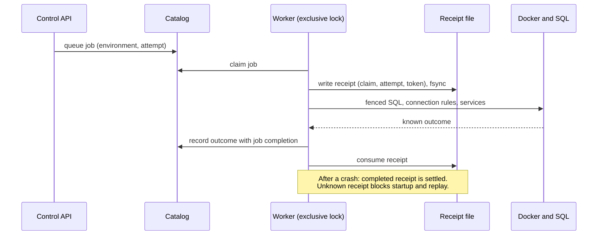

[English](provisioning.md)

# التجهيز

## ما هو

التجهيز هو العمل الخلفي الذي يحوّل طلب "أنشئ بيئة" إلى قاعدة بيانات عاملة وحسابات دخول وقواعد اتصال وخدمات. صُمّم كي لا يؤدي انهيار في أي لحظة إلى تكرار العمل نفسه بناءً على تخمين. وإذا كانت النتيجة مجهولة، يتوقف وينتظر المشغّل.

## لماذا

**الخيار: سجّل قبل أن تنفّذ، وارفض عند الشك.** إنشاء بيئة يمسّ Docker وPostgreSQL والملفات. لو مات العامل في منتصف الطريق، فقد تؤدي إعادة المحاولة ببساطة إلى إنشاء قاعدة ثانية، أو إعادة استخدام حساب دخول نصف جاهز، أو الكتابة فوق قواعد اتصال كتبتها عملية أخرى للتو. لذلك يسبق كل أثر خارجي سجلٌّ دائم، وبعد الانهيار لا يسوّي العامل إلا ما يستطيع إثباته.

**البديل المرفوض: إعادة المحاولة الآمنة للتكرار.** عبارة "شغّله مرة أخرى، فهو آمن للتكرار" تفترض أن كل خطوة تكتشف نتيجتها الجزئية بنفسها. بعض الخطوات لا تقدر على ذلك: قاعدة أُنشئت ولم تُغلق بعد أمام الحسابات الأخرى، أو أمر إعادة تحميل أُرسل ولم يُؤكَّد. والتخمين الخاطئ على محرك مشترك قد يؤذي بيئة مجاورة.

## كيف بنيناه

الأجزاء بكلمات بسيطة (وكل مصطلح منها في [المسرد](../reference/glossary.ar.md) أيضًا):

- **قفل العامل.** لا يعمل إلا عامل تجهيز واحد في كل وقت، ويمسك قفل ملف حصريًا.
- **إيصال الأثر.** قبل أن يبدأ أي أثر، يكتب العامل ملفًا صغيرًا يذكر حجز المهمة ورقم المحاولة بدقة، ويدفعه إلى القرص. لا يكتب أبدًا فوق إيصال موجود. عند إعادة التشغيل يُسوّى الإيصال المكتمل مع الفهرس، أما الإيصال المعلّق الذي لا دليل على نتيجته فيمنع التشغيل وأي إعادة تنفيذ.
- **المراقب والشاهد.** يعمل الأثر تحت عملية مراقبة لها مهلة. ويكتب المجهِّز الأصلي شاهد اكتمال عند انتهائه، فإذا ضاع التأكيد أمكن استرجاعه دون إعادة العمل.
- **السياج.** تحمل تغييرات SQL وقواعد الاتصال رمز عملية. بعد إلغاء الرمز وكتابة شاهد الإلغاء، لا تستطيع عملية قديمة تحمله أن تكتب مرة أخرى، حتى لو استيقظت لاحقًا.
- **تثبيت الجيل.** كل حاوية قاعدة بيانات مُدارة مثبّتة بهويتها الدقيقة. يرفض التشغيل حاوية تغيّرت من تحته، ولا يستبدلها إلا `lab/migrate-generation.py` عبر خطواته المسجّلة في سجل العملية والمختبرة ضد الانهيار.
- **الاستعادة من الفحص المسبق.** الانقطاع الذي يثبت أنه وقع قبل أي تغيير خارجي يمكن إعادته إلى الطابور تلقائيًا، لعدد محدود من المرات.

الكود: [lab/worker.py](../../lab/worker.py)، [lab/effect_receipt.py](../../lab/effect_receipt.py)، [lab/effect_lease.py](../../lab/effect_lease.py)، [lab/provision.py](../../lab/provision.py)، [lab/sql_operation_fence.py](../../lab/sql_operation_fence.py)، [lab/hba_authority.py](../../lab/hba_authority.py)، [lab/hba_generation.py](../../lab/hba_generation.py)، [lab/migrate-generation.py](../../lab/migrate-generation.py). أداة الفحص للقراءة فقط هي [lab/inspect-provisioning.py](../../lab/inspect-provisioning.py).

## الحدود

- هذا منعٌ لإعادة التنفيذ، لا استعادة تلقائية كاملة. النتيجة المجهولة في مرحلة متأخرة تبقى محجوبة حتى يطابقها المشغّل، وسير عمل المطابقة المحدود لهذه الحالات غير مبني.
- اختبارات الانهيار تغطي نقاط تحقق مسمّاة على بيئات اختبار مؤقتة، لا أي انهيار عشوائي، ولا عطل خدمة Docker، ولا انقطاع الكهرباء.
- المجهِّز الذي قُتل قد يترك عميل Docker يعمل، أو أثرًا جاريًا داخل خدمة Docker. الإيصال المعلّق يمنع العامل من تكراره فقط.
- كود المشغّل الموثوق والوصول المباشر إلى Docker أو SQL خارج هذه الحماية.
- لا تحذف أبدًا إيصالًا معلّقًا أو سجل عملية أو تثبيت جيل أو شاهد إلغاء لتتجاوز رفضًا.

## للتعمق

- [إيصالات التجهيز](../engineering/PROVISIONING-RECEIPTS.md)، و[مراقب الأثر](../engineering/EFFECT-GUARDIAN.md)، و[استرجاع نتيجة المجهِّز الأصلي](../engineering/NATIVE-OUTCOME-RECOVERY.md)، و[الاستعادة من الفحص المسبق](../engineering/PREFLIGHT-RECOVERY.md).
- [سياج عمليات SQL](../engineering/SQL-OPERATION-FENCE.md)، و[سلطة عمليات HBA](../engineering/HBA-OPERATION-AUTHORITY-DESIGN.md)، و[دمج HBA في المصدر](../engineering/SOURCE-HBA-INTEGRATION.md).
- [ترحيل جيل الحاوية](../engineering/CONTAINER-GENERATION-MIGRATION.md) و[خريطة التغييرات في التجهيز](../engineering/PROVISIONING-MUTATION-MAP.md).
