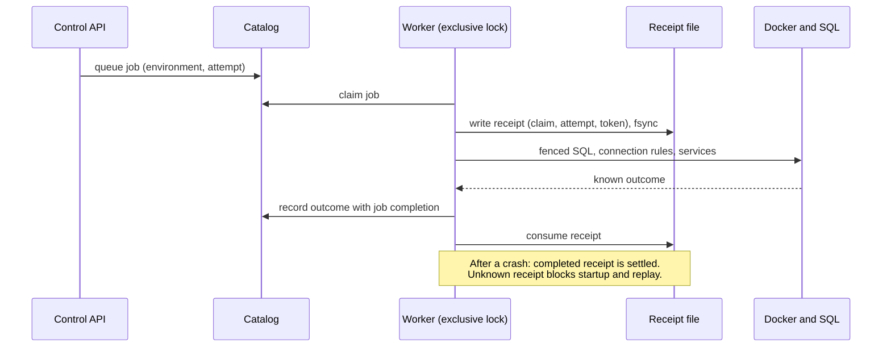

[العربية](provisioning.ar.md)

# Provisioning

## What it is

Provisioning is the background work that turns "create environment" into a running database, logins, connection rules and services. It is written so that a crash at any moment never causes the same work to run twice on a guess; when the outcome is unknown, it stops and asks for an operator.

## Why

**Choice: record before acting, refuse when unsure.** Creating an environment touches Docker, PostgreSQL and files. If the worker dies halfway, simply retrying could create a second database, reuse a half-made login, or overwrite connection rules another operation just wrote. So every external effect is preceded by a durable record, and after a crash the worker settles only what it can prove.

**Rejected alternative: idempotent retry.** "Just run it again, it is idempotent" assumes every step can detect its own partial result. Several cannot (a database created but not yet closed to other logins, a reload that was sent but not confirmed), and guessing wrong on a shared engine can hurt a neighbour.

## How we built it

*Record first, act, then settle. An unknown outcome never runs twice on a guess.*

The same exchange as a sequence:

The pieces, in plain words (each term is also in the [glossary](../reference/glossary.md)):

- **Worker lock.** Only one provisioning worker runs at a time; it holds an exclusive file lock.
- **Effect receipt.** Before an effect starts, the worker writes a small file naming the exact job claim and attempt, and flushes it to disk. It never overwrites an existing one. A completed receipt is settled against the catalog on restart; a pending one with no proof of outcome blocks startup and any replay.
- **Guardian and witness.** The effect runs under a guardian process with a deadline. The native provisioner writes a completion witness when it finishes, so a lost acknowledgment can be recovered without re-running the work.
- **Fencing.** SQL and connection-rule changes carry an operation token. Once a token is revoked (a tombstone is written), a stale process holding it cannot write again, even if it wakes up later.
- **Generation pin.** Each managed database container is pinned by its exact identity. Startup refuses a container that changed underneath it, and only `lab/migrate-generation.py` may replace one, through its own journaled and crash-tested steps.
- **Preflight recovery.** An interruption proven to have happened before any external change can be requeued automatically, a bounded number of times.

Code: [lab/worker.py](../../lab/worker.py), [lab/effect_receipt.py](../../lab/effect_receipt.py), [lab/effect_lease.py](../../lab/effect_lease.py), [lab/provision.py](../../lab/provision.py), [lab/sql_operation_fence.py](../../lab/sql_operation_fence.py), [lab/hba_authority.py](../../lab/hba_authority.py), [lab/hba_generation.py](../../lab/hba_generation.py), [lab/migrate-generation.py](../../lab/migrate-generation.py). The read-only inspector is [lab/inspect-provisioning.py](../../lab/inspect-provisioning.py).

## Limits

- This is replay prevention, not complete automatic recovery. A later-stage unknown outcome stays blocked until an operator reconciles it; the bounded reconciliation workflow for those cases is not built.
- Crash tests cover named checkpoints on disposable fixtures, not arbitrary crashes, Docker daemon failure or power loss.
- A killed provisioner may leave a Docker client or daemon-side effect running; the pending receipt only stops the worker from repeating it.
- Trusted operator code and direct Docker or SQL access are outside this protection.
- Never delete a pending receipt, journal, generation pin or tombstone to get past a refusal.

## Go deeper

- [Provisioning receipts](../engineering/PROVISIONING-RECEIPTS.md), [effect guardian](../engineering/EFFECT-GUARDIAN.md), [native outcome recovery](../engineering/NATIVE-OUTCOME-RECOVERY.md), [preflight recovery](../engineering/PREFLIGHT-RECOVERY.md).
- [SQL operation fence](../engineering/SQL-OPERATION-FENCE.md), [HBA operation authority](../engineering/HBA-OPERATION-AUTHORITY-DESIGN.md), [source HBA integration](../engineering/SOURCE-HBA-INTEGRATION.md).
- [Container generation migration](../engineering/CONTAINER-GENERATION-MIGRATION.md) and the [provisioning mutation map](../engineering/PROVISIONING-MUTATION-MAP.md).
