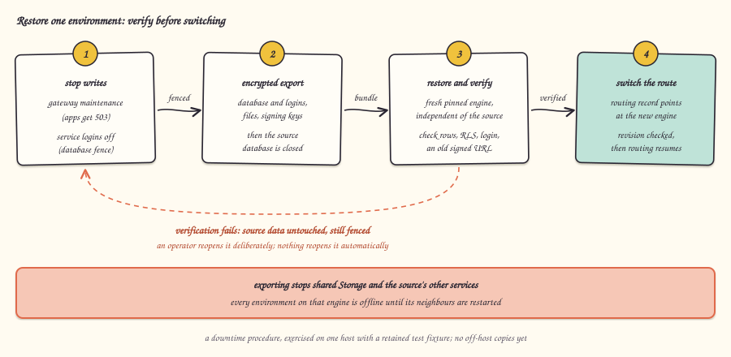

[English](recovery.md)

# الاستعادة

## ما هي

الاستعادة تأخذ بيئة واحدة، فتوقف الكتابة فيها، وتصدّرها مشفّرة، وتستعيدها إلى محرك قاعدة بيانات منفصل، وتتحقق من وصول كل شيء، وبعد ذلك فقط توجّه حركتها إلى النسخة الجديدة. تحتفظ البيئات الأخرى على الخادم ببياناتها، ويُعاد تشغيلها بعد ذلك.

## لماذا

**الخيار: استعد إلى هدف معزول، وتحقق، ثم حوّل.** الاستعادة التي تكتب فوق القاعدة العاملة في مكانها لا تترك شيئًا ترجع إليه إذا ساءت الأمور. أما الاستعادة إلى محرك جديد فتُبقي المصدر سليمًا، وإن كان مسيّجًا، حتى تُفحص النسخة، بما في ذلك الهويات وأمان مستوى الصفوف وروابط الملفات الموقّعة القديمة.

**البدائل المرفوضة.**

- **النسخ المتماثل بديلًا عن النسخ الاحتياطي.** النسخة المتماثلة تنقل الأخطاء والحذف فورًا، فهي ليست نسخة احتياطية.
- **الاستعادة إلى نقطة زمنية على مستوى العنقود.** الاستعادة الفيزيائية في PostgreSQL تعمل على المحرك كله، فاستعادة بيئة واحدة بها ترجع كل البيئات المجاورة إلى الوراء. الاستعادة لكل بيئة تحتاج تصديرًا منطقيًا لقاعدة تلك البيئة مع ملفاتها وإعداداتها.

## كيف بنيناه

1. **السياج.** يوضع سجل توجيه البيئة في الصيانة، فتجيب البوابة بـ`503` بدل تمرير الطلب. وتُحوَّل حسابات دخول خدماتها الثلاثة المحصورة إلى `NOLOGIN`، وتُكتب حالتها الأصلية في سجل العملية، بينما يبقى المشغّل قادرًا على القراءة والتفريغ.
2. **التصدير.** يلتقط `lab/cutover-export.py` تفريغ القاعدة، وحسابات الدخول المحصورة وعضوياتها، وصلاحيات القاعدة وإعداداتها، ومحتوى الملفات وسماتها الممتدة، وإعدادات مستأجر Storage ومفاتيح توقيع روابطه. تُشفَّر الحزمة بـ AES-256-GCM، ويُحفظ المفتاح منفصلًا عنها، وكلاهما بصلاحيات 0600 وخارج Git.
3. **الإغلاق.** بعد حفظ الملف المشفّر، تُضبط قاعدة المصدر لترفض كل الاتصالات. هذه حالة داخل PostgreSQL، فتبقى بعد إعادة التشغيل.
4. **الاستعادة.** محرك PostgreSQL جديد مثبّت الإصدار، بكلمة مرور مدير جديدة وشبكة ووحدة تخزين خاصة به، يستقبل التفريغ في معاملة واحدة. تُعاد بناء بيانات Storage الوصفية وملفاته، ويُعاد تشفير مفاتيح التوقيع بمفتاح الهدف نفسه مع الإبقاء على معرّفاتها.
5. **التحقق.** تُقارن أعداد الصفوف في الجداول وبصمات المحتوى، وتُفحص الأدوار المحصورة والصلاحيات. يبدأ Auth وREST الأصليان على النسخة، ويدخل المستخدم الأصلي بكلمة مروره الأصلية، ويقرأ صفوفًا يحميها أمان مستوى الصفوف، ويعيد رابط موقّع صدر قبل التصدير تنزيل البايتات نفسها.
6. **التحويل.** يُجهَّز مكان التشغيل الجديد على سجل التوجيه، ثم يُستأنف التوجيه مع فحص رقم المراجعة.
7. **البيئات المجاورة.** اضطر التصدير إلى إيقاف Storage المشترك، فتوقفت كل بيئات المصدر طوال مدته. تعود البيئات غير المعنية الآن إلى العمل على المصدر، بينما تبقى البيئة المنقولة موجّهة إلى الهدف.

الكود: [lab/source_fence.py](../../lab/source_fence.py)، [lab/cutover-export.py](../../lab/cutover-export.py)، [lab/recovery_bundle.py](../../lab/recovery_bundle.py)، [lab/recovery-restore-db.py](../../lab/recovery-restore-db.py)، [lab/recovery-check-services.py](../../lab/recovery-check-services.py)، [lab/recovery_reconcile.py](../../lab/recovery_reconcile.py)، [lab/target_runtime.py](../../lab/target_runtime.py)، [src/control/placement.ts](../../src/control/placement.ts). إجراء المشغّل موجود في [النسخ الاحتياطي والاستعادة](../guides/backup-and-restore.ar.md).

## الحدود

- جُرّبت على خادم واحد ببيئة اختبار محفوظة. سكربتات الاستعادة ما زالت خاصة ببيئة الاختبار تلك، وليست منتج نسخ احتياطي عامًا.
- لا نسخ احتياطية مجدولة، ولا نسخ خارج الخادم، ولا استعادة إلى نقطة زمنية.
- هي إجراء يتطلب توقفًا، وليس للبيئة المستعادة وحدها: التصدير المتسق يوقف عملية Storage المشتركة وباقي خدمات مكان تشغيل المصدر كله، فتتوقف كل بيئة على ذلك المحرك، ومعها الدخول إلى لوحة الإدارة، حتى يُعاد تشغيل البيئات المجاورة.
- الصيانة توقف الطلبات الجديدة، لكن الطلبات التي قبلتها عملية بوابة من قبل قد تنقطع عند توقف الخدمات.
- حزمة التصدير تُحمل في الذاكرة بحد أقصى 32 MiB. القواعد الكبيرة ومخازن الكائنات الكبيرة تحتاج صيغة متدفقة.
- بعد أن يقبل الهدف كتابات، يصبح الرجوع إلى المصدر الأقدم غير آمن ويحتاج مطابقة. ولم يثبت بعد الاستئناف التلقائي إذا مات المتحكم نفسه في منتصف العملية.
- محتويات Vault وملفات الدوال ومخازن الكائنات الخارجية غير مشمولة.

## للتعمق

- [الاستعادة المستقلة](../engineering/INDEPENDENT-RESTORE.md): السجل الزمني الكامل وأعداد فحوصاته.
- [تصدير الاستعادة](../engineering/RECOVERY-EXPORT.md) و[تسييج المصدر](../engineering/SOURCE-FENCING.md).
- [دورة حياة الهدف](../engineering/TARGET-LIFECYCLE.md)، و[التوجيه الدائم](../engineering/PERSISTENT-ROUTING.md)، و[مراجعة استعادة Storage](../engineering/reviews/storage-recovery.md).
