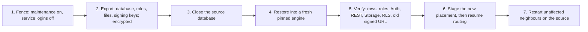

# Recovery

## What it is

Recovery takes one environment, stops its writes, exports it encrypted, restores it into a separate database engine, checks that everything came across, and only then points its traffic at the new copy. The other environments on the server keep their data and are restarted afterwards.

## Why

**Choice: restore into an isolated target, verify, then switch.** A restore that overwrites the live database in place leaves nothing to fall back to when it goes wrong. Restoring into a fresh engine keeps the source untouched (but fenced) until the copy has been checked, including identities, row-level security and old signed file URLs.

**Rejected alternatives.**

- **Replication as backup.** A replica copies mistakes and deletions immediately; it is not a backup.
- **Cluster-level point-in-time recovery.** PostgreSQL's physical recovery works on the whole engine, so restoring one environment would roll back every neighbour. Per-environment recovery needs a logical export of that environment's database plus its files and configuration.

## How we built it

1. **Fence.** The environment's routing record is put in maintenance, so the gateway answers `503` instead of forwarding. Its three scoped service logins are switched to `NOLOGIN` and their original state is written to a journal, while the operator can still read and dump.
2. **Export.** `lab/cutover-export.py` captures the database dump, the scoped logins and their memberships, database grants and settings, file bytes and extended attributes, the Storage tenant configuration and its URL-signing keys. The bundle is encrypted with AES-256-GCM; the key is stored separately, both mode 0600 and out of Git.
3. **Close.** After the encrypted artifact is saved, the source database is set to refuse all connections. This is PostgreSQL state, so it survives restarts.
4. **Restore.** A fresh, pinned PostgreSQL engine with a new administrator password, its own network and its own volume receives the dump in one transaction. Storage metadata and files are rebuilt, and signing keys are re-encrypted under the target's own key while keeping their key IDs.
5. **Verify.** Table counts and content hashes are compared, scoped roles and grants are checked, original Auth and REST start against the copy, the original user logs in with the original password, reads rows protected by row-level security, and a signed URL issued before the export still downloads the same bytes.
6. **Switch.** The new placement is staged on the routing record and routing is resumed with a revision check.
7. **Neighbours.** Unaffected environments restart on the source while the moved environment stays pointed at the target.

Code: [lab/source_fence.py](../../lab/source_fence.py), [lab/cutover-export.py](../../lab/cutover-export.py), [lab/recovery_bundle.py](../../lab/recovery_bundle.py), [lab/recovery-restore-db.py](../../lab/recovery-restore-db.py), [lab/recovery-check-services.py](../../lab/recovery-check-services.py), [lab/recovery_reconcile.py](../../lab/recovery_reconcile.py), [lab/target_runtime.py](../../lab/target_runtime.py), [src/control/placement.ts](../../src/control/placement.ts). The operator procedure is in [backup and restore](../guides/backup-and-restore.md).

## Limits

- Exercised on one host with a retained test fixture. The recovery scripts are still fixture-specific and not a general backup product.
- There are no scheduled backups, no off-host copies and no point-in-time recovery.
- It is a downtime procedure: maintenance stops new requests, but requests already admitted by a gateway process can still be cut off when services stop.
- The export bundle is held in memory and capped at 32 MiB; large databases and object stores need a streaming format.
- Once the target has accepted writes, switching back to the older source is unsafe and needs reconciliation. Automatic resume after the controller itself dies mid-operation is not proven.
- Vault contents, function artifacts and external object stores are not covered.

## Go deeper

- [Independent restore](../engineering/INDEPENDENT-RESTORE.md): the full chronological record and its check counts.
- [Recovery export](../engineering/RECOVERY-EXPORT.md) and [source fencing](../engineering/SOURCE-FENCING.md).
- [Target lifecycle](../engineering/TARGET-LIFECYCLE.md), [persistent routing](../engineering/PERSISTENT-ROUTING.md) and the [storage recovery review](../engineering/reviews/storage-recovery.md).
