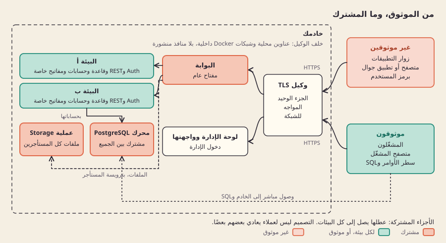
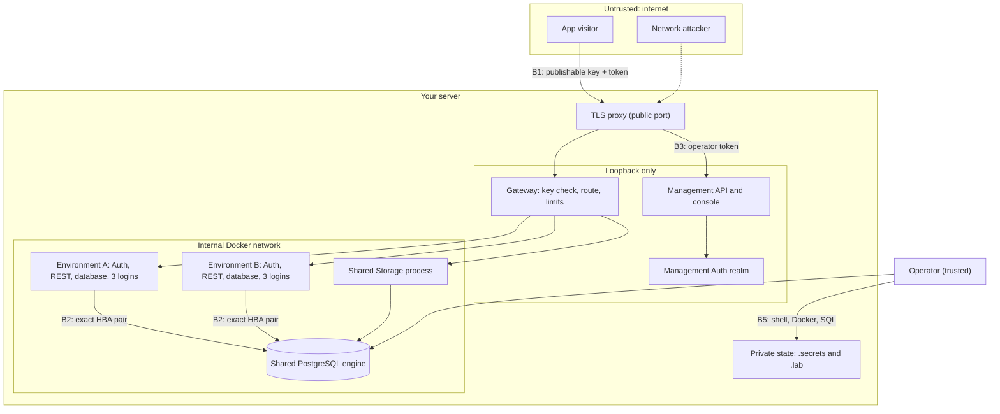

[English](threat-model.md)

# نموذج التهديد

## ما هو

تعرض هذه الصفحة ما يحميه صباربيز، وممن يحميه، وأين تقع حدود الثقة، وأي تخفيف وأي فحص مسجّل يسند كل ادعاء. وتنتهي بالثغرات المعروفة التي ما زالت مفتوحة. تصف الصفحة الكود في هذه المراجعة، وهو قيد التطوير وليس جاهزًا للإنتاج؛ وهي ليست شهادة أمنية.

طريقة الإبلاغ عن مشكلة موجودة في [سياسة الأمان](../../SECURITY.ar.md).

## لماذا

يضع صباربيز مشاريع Supabase كثيرة على خادم واحد. ولا تستحق مشاركة الخادم العناء إلا إذا عجز زوار بيئة ومفاتيحها وحسابات دخول خدماتها عن الوصول إلى بيئة أخرى، وعرف المشغّل بدقة أي الأجزاء مشتركة. نموذج تهديد مكتوب مقابل الكود، يرتبط فيه كل ادعاء باختبار أو ملف أدلة، يُبقي التصميم صادقًا: التخفيف الذي لا فحص له يُسرد ثغرةً، لا ميزةً.

**الخيار: مشغّلون موثوقون، وزوار تطبيقات غير موثوقين.** هذا نموذج الثقة نفسه في [العزل والثقة](isolation-and-trust.ar.md) و[مراجعة الأمان والتشغيل](../engineering/reviews/security-operations.md). لا نحاول الحماية من مشغّل خادم معادٍ.

## كيف بنيناه

*حدود الثقة: الزوار غير الموثوقين لا يدخلون إلا عبر وكيل TLS والبوابة.*

### الأصول

| الأصل | أين يوجد |
| --- | --- |
| بيانات التطبيق لكل بيئة | قاعدة بيانات PostgreSQL واحدة لكل بيئة على المحرك المشترك؛ وكائنات تلك البيئة في عملية Storage المشتركة |
| بيانات اعتماد الخدمات | ثلاثة حسابات دخول للخدمات في كل بيئة (Auth وREST وStorage) بكلمات مرور تُولَّد لكل بيئة (`secrets.token_hex(32)` في `Runtime.provision`، [lab/durable_runtime.py](../../lab/durable_runtime.py))، محفوظة في مجلد الحالة الخاص |
| مفاتيح التوقيع | سر توقيع Auth ومفاتيح توقيع Storage لكل بيئة؛ والمفاتيح العامة لـAPI، ولا يُحفظ منها إلا بصمة SHA-256 ([src/control/keys.ts](../../src/control/keys.ts)) |
| هوية المشغّل | حسابات في نطاق إدارة مخصص في Auth، منفصل عن كل Auth للتطبيقات ([src/control/auth.ts](../../src/control/auth.ts))؛ والعضويات والأدوار في فهرس التحكم |
| النسخ الاحتياطية | حزم التصدير المشفّرة لكل بيئة ومفاتيحها؛ وأي نسخ من وحدات تخزين قواعد البيانات يصنعها المشغّل |

### الأطراف

| الطرف | الثقة | ما يستطيع فعله |
| --- | --- | --- |
| مشغّل الخادم | موثوق | صلاحيات root أو Docker على الخادم، وحساب دخول مدير PostgreSQL، ومجلد الحالة الخاص، وأي SQL في أي بيئة. لا دفاع ضده. |
| زائر التطبيق | غير موثوق | طلبات مجهولة الهوية أو بعد تسجيل الدخول إلى أي بيئة عبر البوابة، بالمفتاح العام لتلك البيئة ورمزه الخاص. |
| خدمة بيئة مخترقة أو مفتاح بيئة مسرّب | غير موثوق | يملك كلمة مرور حساب دخول خدمة في بيئة واحدة، أو مفتاحها العام، أو رمز Auth فيها، ويحاول الوصول إلى بيئة أخرى أو إلى المنصة. |
| اعتمادية مخترقة | غير موثوق | صورة أصل أو حزمة أو إجراء CI معدّل، يعمل بصلاحيات المكوّن الذي يحمّله. |
| مهاجم على الشبكة | غير موثوق | يراقب الحركة بين الزوار أو المشغّلين والخادم أو يعبث بها، أو يرسل طلبات مصنوعة إلى كل ما هو مكشوف. |

### حدود الثقة

- **B1، من الإنترنت إلى البوابة.** كل ما يرسله الزائر غير موثوق إلى أن تربط البوابة مفتاحًا ببيئة واحدة مفعّلة.
- **B2، من بيئة إلى بيئة.** يجب ألا تنفع رموز أي بيئة ولا حسابات دخول خدماتها في أي بيئة أخرى.
- **B3، من هوية التطبيق إلى الإدارة.** يجب ألا يُعامَل مستخدمو التطبيق أبدًا معاملة المشغّلين.
- **B4، من الشبكة العامة إلى لوحة الإدارة.** وكيل TLS وحده يواجه الشبكة؛ وكل ما خلفه يرتبط بـloopback.
- **B5، الخادم والأسرار.** تبقى بيانات الاعتماد في ملفات خاصة، بعيدًا عن السجلات والأدلة. المشغّل داخل هذا الحد.
- **B6، سلسلة التوريد.** لا تعمل إلا صور الأصل مثبّتة الإصدار.

### التهديدات والتخفيف

تكتب الفحوص الحية ملفات الأدلة، ولكل ملف نطاقه الخاص؛ وأسماء الفحوص أدناه منقولة منها حرفيًا. الاختبارات تعمل ضمن حزم اختبارات الوحدة.

| الحد | التهديد | التخفيف | الإثبات |
| --- | --- | --- | --- |
| B1 | طلب بلا مفتاح، أو بمفتاح البيئة A على مسار البيئة B | تعبير نمطي على المسار يختار البيئة؛ ويجب أن يُحَل المفتاح لتلك البيئة في مخزن المفاتيح؛ والبيئات المعطّلة أو المجهولة تجيب بـ404 ([src/gateway/handler.ts](../../src/gateway/handler.ts)) | [tests/gateway.test.ts](../../tests/gateway.test.ts) ("missing key"، "cross environment"، "disabled environment")؛ [storage-gateway-checks.json](../evidence/storage-gateway-checks.json) ("API key cannot select neighbor Storage route") |
| B1 | العميل يختار خادم الأصل أو يخرج من المسار | الأصل يأتي من سجل المسارات وحده؛ والشرطات المائلة المرمّزة والشرطات العكسية وNUL مرفوضة؛ ولا تُمرَّر إلا قائمة ثابتة من الترويسات | [tests/gateway.test.ts](../../tests/gateway.test.ts) ("encoded slash"، "forward selected route and strip client-injected internal headers") |
| B1 | العميل يختار مستأجر Storage آخر | ترويسة المستأجر لا تُضبط إلا من إعدادات المسار الموثوقة | [storage-gateway-checks.json](../evidence/storage-gateway-checks.json) ("injected tenant header cannot select neighbor")؛ [tests/gateway.test.ts](../../tests/gateway.test.ts) |
| B1 | مفتاح ملغى يظل يعمل، أو عطل في مخزن المفاتيح يرتد إلى قبول المفاتيح | البحث يستثني الصفوف الملغاة؛ وخطأ البحث يجيب بـ503، ولا يرتد أبدًا إلى مفتاح ثابت | [tests/gateway.test.ts](../../tests/gateway.test.ts) ("removed key stops subsequent requests"، "key store failure cannot fall back to static key acceptance")؛ [connection-checks.json](../evidence/connection-checks.json) ("revocation immediately removes gateway access") |
| B1 | قراءة Storage بلا مفتاح تصل إلى بيانات خاصة | لا يُعفى من المفتاح إلا قراءة الكائنات العامة والروابط الموقّعة ذات الرمز الواحد؛ ويتحقق Storage من الظهور والتوقيع | [tests/gateway.test.ts](../../tests/gateway.test.ts) ("only public and signed Storage reads may omit API keys")؛ [storage-url-checks.json](../evidence/storage-url-checks.json) ("public URL cannot disclose private bucket"، "signed URL cannot select another environment") |
| B1 | بيئة واحدة تُغرق البوابة | قبول تزامني لكل بيئة بلا طابور، وحد 1 MiB للجسم (ورفع Storage حتى حد الرفع، ويفشل بعد توقف ثلاثين ثانية)، ومهلة لقراءة الجسم، ومهلة 15 ثانية للأصل | [tests/concurrency.test.ts](../../tests/concurrency.test.ts)؛ [tests/gateway.test.ts](../../tests/gateway.test.ts) ("oversize stream rejected before upstream"، "slow body deadline ...")؛ [gateway-overload-checks.json](../evidence/gateway-overload-checks.json) |
| B2 | رمز مستخدم من البيئة A يُستعمل في Auth أو REST في البيئة B | سر توقيع Auth منفصل لكل بيئة | [upstream-environment-checks.json](../evidence/upstream-environment-checks.json) ("env_alpha token denied by env_beta Auth"، "... by env_beta REST") |
| B2 | حساب دخول خدمة في البيئة A يتصل بقاعدة B أو يصبح مديرًا | لا تُمنح صلاحية `CONNECT` إلا لحسابات دخول البيئة نفسها؛ وقواعد HBA تسمّي أزواج القاعدة وحساب الدخول بدقة مع SCRAM، وتنتهي بـ`reject` لكل ما عداها (`hba_content` في [lab/durable_runtime.py](../../lab/durable_runtime.py)) | [upstream-environment-checks.json](../evidence/upstream-environment-checks.json) ("env_alpha auth denied database env_beta"، "env_alpha REST role cannot assume global admin")؛ [shared-storage-checks.json](../evidence/shared-storage-checks.json) ("env_alpha storage credential denied by env_beta") |
| B2 | قواعد الاتصال تضيع أو تُكتب نصف كتابة بعد انهيار، فتُفتح أزواج خاطئة أو تُغلق | نشر HBA مسجَّل في سجل العملية ومسيّج، بملكية دقيقة وتأكيد لإعادة التحميل | [lab/test_hba_authority.py](../../lab/test_hba_authority.py)، [lab/test_atomic_hba.py](../../lab/test_atomic_hba.py)؛ [upstream-hba-apply-checks.json](../evidence/upstream-hba-apply-checks.json) |
| B2 | مسار الكائن نفسه في بيئتين يعيد بايتات البيئة الأخرى | مستأجر Storage لكل بيئة بقاعدة بياناته ومفاتيح توقيعه | [shared-storage-checks.json](../evidence/shared-storage-checks.json) ("env_alpha same object path returns only its own bytes"، "env_alpha rejects other environment service token") |
| B3 | واجهة الإدارة تقبل رمز مستخدم من التطبيق | هوية الإدارة تأتي من نقطة Auth ثابتة ومخصصة؛ والمستخدمون المجهولون مرفوضون | [management-checks.json](../evidence/management-checks.json) ("application realm token rejected by live management Auth")؛ [tests/management.test.ts](../../tests/management.test.ts) |
| B3 | انتحال الفاعل أو الدور في ترويسة أو جسم طلب | الفاعل يُستخرج من المصادقة وحدها؛ والعضويات تُقرأ من الفهرس في كل طلب | [management-checks.json](../evidence/management-checks.json) ("body actor spoofing rejected"، "valid nonmember denied despite injected owner header")؛ [tests/catalog.test.ts](../../tests/catalog.test.ts) |
| B3 | هوية التطبيق تُصدر المفاتيح أو تسردها | مسارات المفاتيح تتطلب فاعلًا إداريًا له صلاحيات على تلك البيئة؛ والمفاتيح الخام تُعاد مرة واحدة، والقوائم لا تحمل إلا البيانات الوصفية | [connection-checks.json](../evidence/connection-checks.json) ("application identity cannot issue management keys"، "key list never discloses raw token")؛ [tests/key-http.test.ts](../../tests/key-http.test.ts)، [tests/keys.test.ts](../../tests/keys.test.ts) |
| B4 | إعادة توجيه مفتوحة أو حقن ترويسة host عند الحافة العامة | إعادة التوجيه والمضيف المُمرَّر يأتيان من `--public-host`؛ وترويسات التمرير التي يرسلها العميل تُحذف؛ ويجب أن يكون الأصل على loopback ([deploy/console-tls-proxy.ts](../../deploy/console-tls-proxy.ts)) | [tls-termination.json](../evidence/tls-termination.json) ("the redirect never points at a client supplied host"، "a non-loopback upstream is refused")؛ [lab/test_tls_termination.py](../../lab/test_tls_termination.py) |
| B4 | تسجيل بيانات الاعتماد عند الحافة، أو مفتاح شهادة قابل للقراءة | الوكيل لا يسجّل إلا الطريقة والمسار والحالة؛ ويرفض مفتاحًا تقرؤه المجموعة أو الجميع | [tls-termination.json](../evidence/tls-termination.json) ("a group or world readable key is refused")؛ [lab/test_tls_termination.py](../../lab/test_tls_termination.py) (`test_the_proxy_never_logs_bodies_or_credentials`) |
| B5 | ملفات الأسرار يقرؤها مستخدمون آخرون | ملف المشغّل ومخزن المفاتيح يُكتبان بالصلاحية `0600` | ملف المشغّل مختبر في [lab/test_operator_file.py](../../lab/test_operator_file.py)؛ وصلاحية مخزن المفاتيح مضبوطة في [src/control/keys.ts](../../src/control/keys.ts) (`chmodSync(path,0o600)`)، في المصدر فقط، بلا اختبار |
| B5 | كلمات مرور في مخرجات الأوامر أو الإشعارات أو الأدلة المسجّلة | حجب الأسرار قبل الإخراج؛ والملخصات تُسقط قيم الأسرار | [lab/test_mail_config.py](../../lab/test_mail_config.py)، [lab/test_notifications.py](../../lab/test_notifications.py)، [lab/test_deployment_rehearsal.py](../../lab/test_deployment_rehearsal.py)، [lab/test_runtime_reuse.py](../../lab/test_runtime_reuse.py) |
| B5 | حزمة التصدير تحمل بيانات اعتماد على مستوى المنصة | التصدير لا يضم إلا حسابات دخول البيئة المختارة وإعداداتها | [recovery-export-checks.json](../evidence/recovery-export-checks.json) ("shared platform credentials not added to configuration") |
| B6 | صورة أصل عُبث بها أو تغيّرت بصمت | الصور تعمل ببصمة مثبّتة؛ والفحص المسبق يرفض تثبيتًا مفقودًا أو غير مطابق ولا يسحب شيئًا أبدًا؛ والحاويات المحفوظة تُفحص بحثًا عن الانحراف قبل إعادة استخدامها | [lab/test_pinned_images.py](../../lab/test_pinned_images.py)، [lab/test_runtime_reuse.py](../../lab/test_runtime_reuse.py)؛ [pinned-images.json](../evidence/pinned-images.json) |

### مقارنة بحساب دخول خدمة مشترك

مشروع [GustavoMartins123/supabase-multitenant](https://github.com/GustavoMartins123/supabase-multitenant) هو الأقرب إلينا في البنية بين المشاريع الموجودة. في قوالبه لكل مشروع عند الإيداع [`0ec74541`](https://github.com/GustavoMartins123/supabase-multitenant/tree/0ec74541bda019f644ba6e77fc955a028a91ffab/servidor/generateProject) (2026-08-11)، تتصل Auth وREST وStorage في كل مشروع بالأدوار العامة على مستوى العنقود `supabase_auth_admin` و`authenticator` و`supabase_storage_admin`، بكلمة المرور الوحيدة `POSTGRES_PASSWORD` المقروءة من الملف المشترك `servidor/.env`؛ ولاحقة `.project_id` على اسم المستخدم تختار مستأجر المشروع في مجمّع الاتصالات ([dockercomposetemplate](https://github.com/GustavoMartins123/supabase-multitenant/blob/0ec74541bda019f644ba6e77fc955a028a91ffab/servidor/generateProject/dockercomposetemplate)، [.envtemplate](https://github.com/GustavoMartins123/supabase-multitenant/blob/0ec74541bda019f644ba6e77fc955a028a91ffab/servidor/generateProject/.envtemplate)). أما صباربيز فينشئ ثلاثة حسابات دخول لكل بيئة بكلمات مرور مولَّدة خاصة بها، وقاعدة HBA واحدة لكل زوج دقيق من القاعدة وحساب الدخول. هذه قراءة للمصدر، لا اختبار لذلك المشروع، ولا تقول شيئًا عن بقية تصميمه؛ والمقارنة الأوسع في [البدائل](../engineering/reviews/alternatives-product.md).

## الحدود

### الثغرات المعروفة

هذه الثغرات مفتوحة. نسردها ليقرر المشغّل هل يناسبه صباربيز، ولكي يُقاس أي بلاغ عنها بما هو معلن أصلًا.

- **عملية Storage المشتركة تحمل إعدادات كل المستأجرين.** اختراق هذه العملية الواحدة اختراق لملفات كل البيئات. انظر [مراجعة Storage المشترك](../engineering/reviews/shared-storage.md).
- **محرك PostgreSQL المشترك حدُّ فشل مشترك.** الانهيار أو امتلاء القرص أو القفل الطويل يصيب كل بيئة عليه، والأدوار القياسية لـAPI (`anon` و`authenticated` و`service_role`) توجد مرة واحدة في كل محرك.
- **الروابط الموقّعة تبقى بعد إلغاء المفتاح حتى تنتهي صلاحيتها.** إلغاء مفتاح عام يوقف الطلبات التي تحمله فورًا، لكن رابط Storage موقّعًا صدر قبل ذلك يظل يعمل حتى موعد انتهائه ([storage-url-checks.json](../evidence/storage-url-checks.json)، "env_alpha signed URL remains independent of API-key revocation until expiry").
- **لا سجل تدقيق يكشف العبث ولا سجل خارج الخادم.** يسجّل الفهرس أحداث التدقيق محليًا (`audit_events` في [src/control/catalog.ts](../../src/control/catalog.ts))؛ ويستطيع أي شخص يصل إلى الخادم تغييرها، ولا شيء يرسلها إلى مكان آخر.
- **يحمل Studio الخاص بكل بيئة حساب دخول إلى قاعدة البيانات أثناء عمله.** لا يُقدَّم إلا من خلف جلسة موقّعة من لوحة الإدارة على عنوانه الخاص، وحسابه ليس مستخدمًا خارقًا ويُغلق حين يتوقف Studio ([دليل Studio](../guides/studio.ar.md)). المالك أو المدير صاحب الجلسة المفتوحة يقرأ كل صفوف تلك البيئة، ومنها الصفوف التي يخفيها أمان الصفوف.
- **لا نسخ احتياطية خارج الخادم.** لا شيء ينسخ البيانات خارج الخادم؛ وعلى المشغّل أن يرتّب ذلك بنفسه ([النسخ الاحتياطي والاستعادة](../guides/backup-and-restore.ar.md)).
- **المشغّلون يستطيعون تشغيل أي SQL بحكم التصميم.** يصمد العزل أمام زوار التطبيقات وبيانات اعتماد البيئات المسرّبة، لا أمام كاتب SQL موثوق.
- **إجراءات CI مثبّتة بالوسم، لا ببصمة الإيداع (commit SHA)** ([.github/workflows/ci.yml](../../.github/workflows/ci.yml)). لو نُقل وسم لشغّل CI كودًا مختلفًا.
- **حساب الخدمة يعادل root.** يضعه [deploy/sbarbase.service](../../deploy/sbarbase.service) في مجموعة `docker` ليتمكن من إدارة الحاويات.
- **قواعد HBA تقيّد حساب الدخول والقاعدة، لا عنوان المصدر.** تستخدم القواعد `0.0.0.0/0` وتعتمد على وجود القاعدة في شبكة Docker داخلية بلا منفذ منشور؛ ويتصل مدير PostgreSQL عبر المقبس المحلي بـ`trust`، وهذا يلائم نموذج المشغّل الموثوق.
- **إعادة تحميل قواعد الاتصال وحدها لا تنهي الجلسات المفتوحة.** مسارات السياج تنهيها صراحة ([lab/source_fence.py](../../lab/source_fence.py))؛ أما أي تغيير آخر يعتمد على إعادة تحميل HBA وحدها فيترك الاتصالات القائمة إلى أن تُغلق.
- **لا تعالج البوابة بعدُ Realtime ولا CORS في المتصفح ولا OAuth**، وفئات الموارد مضبوطة في الإعدادات لكنها غير معايرة تحت حمل متواصل.

## للتعمق

- [سياسة الأمان](../../SECURITY.ar.md): الإصدارات المدعومة، والإبلاغ الخاص، وقائمة التحصين للمشغّل.
- [العزل والثقة](isolation-and-trust.ar.md) و[مراجعة الأمان والتشغيل](../engineering/reviews/security-operations.md).
- [دمج HBA في محرك المصدر](../engineering/SOURCE-HBA-INTEGRATION.md)، و[الاستبدال الذري لملف HBA](../engineering/ATOMIC-HBA-REPLACEMENT.md)، و[سياج عمليات SQL](../engineering/SQL-OPERATION-FENCE.md).
- [حمل البوابة الزائد](../engineering/GATEWAY-OVERLOAD.md)، و[تصريف البوابة](../engineering/GATEWAY-DRAIN.md)، وقسم HTTPS وكشف الشبكة في [دليل النشر على الخادم](../guides/server-deployment.ar.md).
