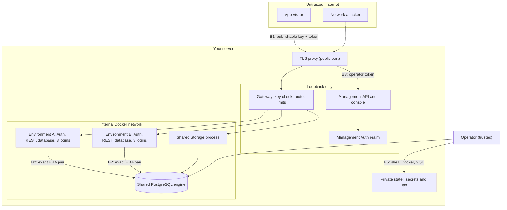

# Threat model

## What it is

This page lists what Sbarbase protects, who it protects it from, where the trust boundaries are, and which mitigation and which recorded check stand behind each claim. It ends with the gaps that are known and open. It describes the code at this revision, which is in development and not production ready; it is not a security certification.

How to report a problem is in the [security policy](../../SECURITY.md).

## Why

Sbarbase puts many Supabase projects on one server. Sharing a server is only worth it if one environment's visitors, keys or service logins cannot reach another environment, and if the operator knows exactly which parts are shared. A threat model written against the code, with every claim tied to a test or an evidence file, keeps the design honest: a mitigation without a check is listed as a gap, not as a feature.

**Choice: trusted operators, untrusted app visitors.** This is the same trust model as [isolation and trust](isolation-and-trust.md) and the [security and operations review](../engineering/reviews/security-operations.md). Protection against a hostile server operator is not attempted.

## How we built it

### Assets

| Asset | Where it lives |
| --- | --- |
| Application data per environment | One PostgreSQL database per environment on the shared engine; that environment's objects in the shared Storage process |
| Service credentials | Three service logins per environment (Auth, REST, Storage) with passwords generated per environment (`secrets.token_hex(32)` in `Runtime.provision`, [lab/durable_runtime.py](../../lab/durable_runtime.py)), kept in the private state directory |
| Signing keys | Each environment's Auth signing secret and Storage signing keys; publishable API keys, stored only as SHA-256 hashes ([src/control/keys.ts](../../src/control/keys.ts)) |
| Operator identity | Accounts in a dedicated management Auth realm, separate from every application Auth ([src/control/auth.ts](../../src/control/auth.ts)); memberships and roles in the control catalog |
| Backups | Encrypted per-environment export bundles and their keys; any copies of the database volumes the operator makes |

### Actors

| Actor | Trust | What they can do |
| --- | --- | --- |
| Host operator | Trusted | Root or Docker on the host, the PostgreSQL administrator login, the private state directory, arbitrary SQL in any environment. Not defended against. |
| Application visitor | Untrusted | Anonymous or signed-in requests to any environment through the gateway, with that environment's publishable key and their own token. |
| Compromised environment service or leaked environment key | Untrusted | Holds one environment's service login password, publishable key or Auth token and tries to reach another environment or the platform. |
| Compromised dependency | Untrusted | A modified upstream image, package or CI action that runs with the privileges of the component that loads it. |
| Network attacker | Untrusted | Observes or tampers with traffic between visitors or operators and the server, or sends crafted requests to whatever is exposed. |

### Trust boundaries

- **B1, internet to gateway.** Everything a visitor sends is untrusted until the gateway has bound a key to one enabled environment.
- **B2, environment to environment.** Each environment's tokens and service logins must be useless in any other environment.
- **B3, application identity to management.** An application's users must never be treated as operators.
- **B4, public network to console.** Only the TLS proxy faces the network; everything behind it binds loopback.
- **B5, host and secrets.** Credentials stay in private files and out of logs and evidence. The operator is inside this boundary.
- **B6, supply chain.** Only pinned upstream images run.

### Threats and mitigations

Evidence files are written by live probes and each carries its own scope; the check names below are quoted from them. Tests run in the unit suites.

| Boundary | Threat | Mitigation | Shown by |
| --- | --- | --- | --- |
| B1 | Request without a key, or with environment A's key on environment B's route | Route regex picks the environment; the key must resolve for that environment in the key store; disabled or unknown environments answer 404 ([src/gateway/handler.ts](../../src/gateway/handler.ts)) | [tests/gateway.test.ts](../../tests/gateway.test.ts) ("missing key", "cross environment", "disabled environment"); [storage-gateway-checks.json](../evidence/storage-gateway-checks.json) ("API key cannot select neighbor Storage route") |
| B1 | Client chooses the upstream host or escapes the path | Upstream comes only from the route registry; encoded slashes, backslashes and NUL are refused; only a fixed list of headers is forwarded | [tests/gateway.test.ts](../../tests/gateway.test.ts) ("encoded slash", "forward selected route and strip client-injected internal headers") |
| B1 | Client picks another Storage tenant | Tenant header set only from trusted route configuration | [storage-gateway-checks.json](../evidence/storage-gateway-checks.json) ("injected tenant header cannot select neighbor"); [tests/gateway.test.ts](../../tests/gateway.test.ts) |
| B1 | Revoked key keeps working, or a key store failure falls back to accepting keys | Lookup excludes revoked rows; a lookup error answers 503, never a static fallback | [tests/gateway.test.ts](../../tests/gateway.test.ts) ("removed key stops subsequent requests", "key store failure cannot fall back to static key acceptance"); [connection-checks.json](../evidence/connection-checks.json) ("revocation immediately removes gateway access") |
| B1 | Keyless Storage read reaches private data | Only public object reads and signed URLs with one token may omit a key; Storage checks visibility and signature | [tests/gateway.test.ts](../../tests/gateway.test.ts) ("only public and signed Storage reads may omit API keys"); [storage-url-checks.json](../evidence/storage-url-checks.json) ("public URL cannot disclose private bucket", "signed URL cannot select another environment") |
| B1 | One environment floods the gateway | Per-environment concurrency admission without a queue, 1 MiB body cap, body read deadline, 15 second upstream deadline | [tests/concurrency.test.ts](../../tests/concurrency.test.ts); [tests/gateway.test.ts](../../tests/gateway.test.ts) ("oversize stream rejected before upstream", "slow body deadline ..."); [gateway-overload-checks.json](../evidence/gateway-overload-checks.json) |
| B2 | Environment A's user token used at B's Auth or REST | Separate Auth signing secret per environment | [upstream-environment-checks.json](../evidence/upstream-environment-checks.json) ("env_alpha token denied by env_beta Auth", "... by env_beta REST") |
| B2 | Environment A's service login connects to B's database or becomes an administrator | `CONNECT` granted only to the environment's own logins; HBA rules name exact database and login pairs with SCRAM and end in `reject` for everything else (`hba_content` in [lab/durable_runtime.py](../../lab/durable_runtime.py)) | [upstream-environment-checks.json](../evidence/upstream-environment-checks.json) ("env_alpha auth denied database env_beta", "env_alpha REST role cannot assume global admin"); [shared-storage-checks.json](../evidence/shared-storage-checks.json) ("env_alpha storage credential denied by env_beta") |
| B2 | Connection rules lost or half written after a crash, opening or closing the wrong pairs | Journaled, fenced HBA publication with exact ownership and reload acknowledgment | [lab/test_hba_authority.py](../../lab/test_hba_authority.py), [lab/test_atomic_hba.py](../../lab/test_atomic_hba.py); [upstream-hba-apply-checks.json](../evidence/upstream-hba-apply-checks.json) |
| B2 | Same object path in two environments returns the other's bytes | Storage tenant per environment with its own database and signing keys | [shared-storage-checks.json](../evidence/shared-storage-checks.json) ("env_alpha same object path returns only its own bytes", "env_alpha rejects other environment service token") |
| B3 | Application user's token accepted by the management API | Management identity comes from a fixed, dedicated Auth endpoint; anonymous users refused | [management-checks.json](../evidence/management-checks.json) ("application realm token rejected by live management Auth"); [tests/management.test.ts](../../tests/management.test.ts) |
| B3 | Actor or role spoofed in a header or body | Actor derived only from authentication; memberships read from the catalog on each request | [management-checks.json](../evidence/management-checks.json) ("body actor spoofing rejected", "valid nonmember denied despite injected owner header"); [tests/catalog.test.ts](../../tests/catalog.test.ts) |
| B3 | Application identity issues or lists keys | Key routes require a management actor with rights on that environment; raw keys returned once, listings carry metadata only | [connection-checks.json](../evidence/connection-checks.json) ("application identity cannot issue management keys", "key list never discloses raw token"); [tests/key-http.test.ts](../../tests/key-http.test.ts), [tests/keys.test.ts](../../tests/keys.test.ts) |
| B4 | Open redirect or host header injection at the public edge | Redirect and forwarded host come from `--public-host`; client forwarding headers dropped; upstream must be loopback ([deploy/console-tls-proxy.ts](../../deploy/console-tls-proxy.ts)) | [tls-termination.json](../evidence/tls-termination.json) ("the redirect never points at a client supplied host", "a non-loopback upstream is refused"); [lab/test_tls_termination.py](../../lab/test_tls_termination.py) |
| B4 | Credentials logged at the edge, or a readable certificate key | Proxy logs method, path and status only; refuses a group or world readable key | [tls-termination.json](../evidence/tls-termination.json) ("a group or world readable key is refused") |
| B5 | Secret files readable by other users | Operator and key files written with mode `0600` | [lab/test_operator_file.py](../../lab/test_operator_file.py); [src/control/keys.ts](../../src/control/keys.ts) (`chmodSync(path,0o600)`) |
| B5 | Passwords in command output, notifications or recorded evidence | Redaction before output; summaries omit secret values | [lab/test_mail_config.py](../../lab/test_mail_config.py), [lab/test_notifications.py](../../lab/test_notifications.py), [lab/test_deployment_rehearsal.py](../../lab/test_deployment_rehearsal.py), [lab/test_runtime_reuse.py](../../lab/test_runtime_reuse.py) |
| B5 | Export bundle carries platform-wide credentials | Export includes only the selected environment's logins and configuration | [recovery-export-checks.json](../evidence/recovery-export-checks.json) ("shared platform credentials not added to configuration") |
| B6 | Tampered or silently changed upstream image | Images run by pinned digest; preflight refuses a missing or mismatched pin and never pulls; retained containers are checked for drift before reuse | [lab/test_pinned_images.py](../../lab/test_pinned_images.py), [lab/test_runtime_reuse.py](../../lab/test_runtime_reuse.py); [pinned-images.json](../evidence/pinned-images.json) |

### Compared with a shared service login

[GustavoMartins123/supabase-multitenant](https://github.com/GustavoMartins123/supabase-multitenant) is the closest existing project in topology. In its per-project templates at commit [`0ec74541`](https://github.com/GustavoMartins123/supabase-multitenant/tree/0ec74541bda019f644ba6e77fc955a028a91ffab/servidor/generateProject) (2026-08-11), every project's Auth, REST and Storage connect as the cluster-wide roles `supabase_auth_admin`, `authenticator` and `supabase_storage_admin`, with the one `POSTGRES_PASSWORD` read from the shared `servidor/.env`; a `.project_id` suffix on the user name selects the project's pooler tenant ([dockercomposetemplate](https://github.com/GustavoMartins123/supabase-multitenant/blob/0ec74541bda019f644ba6e77fc955a028a91ffab/servidor/generateProject/dockercomposetemplate), [.envtemplate](https://github.com/GustavoMartins123/supabase-multitenant/blob/0ec74541bda019f644ba6e77fc955a028a91ffab/servidor/generateProject/.envtemplate)). Sbarbase instead creates three logins per environment with their own generated passwords and one HBA rule per exact database and login pair. This is a reading of source, not a test of that project, and it says nothing about the rest of its design; the broader comparison is in [alternatives](../engineering/reviews/alternatives-product.md).

## Limits

### Known gaps

These are open. They are listed so an operator can decide whether Sbarbase fits, and so a report about them is judged against what is already public.

- **The shared Storage process holds every tenant's configuration.** A compromise of that one process is a compromise of every environment's files. See the [shared Storage review](../engineering/reviews/shared-storage.md).
- **The shared PostgreSQL engine is a shared failure boundary.** A crash, full disk or long lock affects every environment on it, and the canonical API roles (`anon`, `authenticated`, `service_role`) exist once per engine.
- **Signed URLs survive key revocation until they expire.** Revoking a publishable key stops keyed requests at once, but a Storage signed URL issued earlier still works until its expiry ([storage-url-checks.json](../evidence/storage-url-checks.json), "env_alpha signed URL remains independent of API-key revocation until expiry").
- **No tamper-evident or off-host audit log.** The catalog records audit events locally (`audit_events` in [src/control/catalog.ts](../../src/control/catalog.ts)); anyone with host access can change them, and nothing ships them elsewhere.
- **Per-environment Studio is not built.** It is [specified](../engineering/STUDIO-INTEGRATION.md), not served. When it lands it carries a database connection string and must never be reachable without authentication.
- **No off-host backups.** Nothing copies data off the server; the operator has to arrange it ([backup and restore](../guides/backup-and-restore.md)).
- **Operators can run arbitrary SQL by design.** Isolation holds against application visitors and leaked environment credentials, not against a trusted SQL author.
- **CI actions are pinned by tag, not by commit SHA** ([.github/workflows/ci.yml](../../.github/workflows/ci.yml)). A moved tag would run different code in CI.
- **The service account is root equivalent.** [deploy/sbarbase.service](../../deploy/sbarbase.service) gives it the `docker` group so it can manage containers.
- **HBA rules restrict login and database, not source address.** Rules use `0.0.0.0/0` and rely on the database sitting on an internal Docker network with no published port; the PostgreSQL administrator connects over the local socket with `trust`, which fits the trusted operator model.
- **Reloading connection rules does not end sessions already open.** A revoked login keeps an existing connection until it closes.
- **Realtime, browser CORS and OAuth are not handled by the gateway yet**, and resource tiers are configured, not calibrated under sustained load.

## Go deeper

- [Security policy](../../SECURITY.md): supported versions, private reporting and the operator hardening checklist.
- [Isolation and trust](isolation-and-trust.md) and the [security and operations review](../engineering/reviews/security-operations.md).
- [Source HBA integration](../engineering/SOURCE-HBA-INTEGRATION.md), [atomic HBA replacement](../engineering/ATOMIC-HBA-REPLACEMENT.md) and [SQL operation fence](../engineering/SQL-OPERATION-FENCE.md).
- [Gateway overload](../engineering/GATEWAY-OVERLOAD.md), [gateway drain](../engineering/GATEWAY-DRAIN.md) and the [server deployment guide](../guides/server-deployment.md) section on HTTPS and network exposure.
