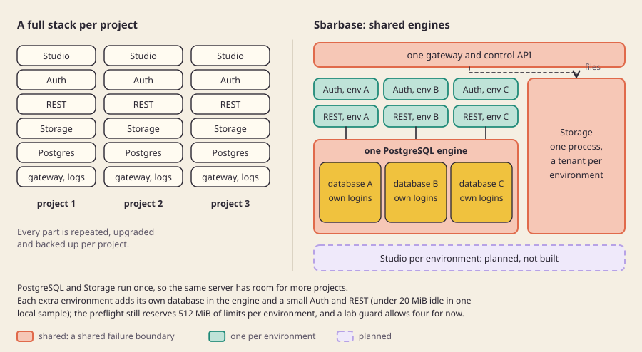

[English](why.md)

# لماذا صباربيز

## ما هو

يتيح صباربيز لخادم واحد أن يستضيف مشاريع Supabase كثيرة لعدة عملاء، مع احتفاظ كل بيئة بقاعدة بياناتها وحسابات دخولها وخدمات Supabase الأصلية. الهدف أن يصبح النسخ الاحتياطي لبيئة واحدة واستعادتها ونقلها وترقيتها عملًا روتينيًا لا يعرّض البيئات الأخرى للخطر.

## لماذا

**المشكلة.** Supabase الرسمي المستضاف ذاتيًا نشرٌ لمشروع واحد: حزمة واحدة، وStudio واحد، ومشروع واحد. والمطوّر أو الوكالة التي لديها عشرة تطبيقات صغيرة لعملائها أمامها اليوم خياران واضحان، وكلاهما مكلف:

- تشغيل حزمة Supabase كاملة لكل تطبيق. الحل بسيط وعزله جيد، لكن كل حزمة تكرر PostgreSQL وAuth وREST وStorage والحاويات المساندة لها، وكل واحدة تُنسخ احتياطيًا وتُرقّى وحدها.
- وضع عدة تطبيقات في مشروع Supabase واحد، يفصل بينها المخطط (schema). الحل رخيص، لكن التطبيقات تتشارك عندها Auth واحدًا ومجموعة واحدة من أدوار API ودورة حياة واحدة: لا تستطيع استعادة تطبيق أو نقله دون المساس بالبقية.

**دليل على أن الناس يريدون هذا.** مشاريع مفتوحة المصدر مستقلة عديدة تحاول أصلًا تشغيل مشاريع Supabase كثيرة على خادم واحد، وهذا يثبت أن الحاجة حقيقية. هذه المشاريع التي راجعناها في [مراجعة البدائل](../engineering/reviews/alternatives-product.md):

| المشروع | الأسلوب | ملاحظة المراجعة |
|---|---|---|
| GustavoMartins123/supabase-multitenant | PostgreSQL مشترك وبعض الخدمات المشتركة؛ قاعدة بيانات وAuth وREST وStorage لكل مشروع | الأقرب في البنية؛ يصف نفسه بأنه غير رسمي وقيد التطوير؛ نسخة Realtime المعدّلة والدوال (Functions) المشتركة تحتاج إلى تدقيق |
| arunrajiah/supafleet | PostgreSQL مشترك؛ قاعدة بيانات وAuth وREST وStorage لكل مشروع | أداة التجهيز في سطر الأوامر تعيد استخدام كلمة مرور عامة واحدة لقاعدة البيانات في خدمات كل المشاريع، فإذا اختُرقت خدمة مشروع لم تحصرها بيانات اعتمادها |
| Coolify، Dokploy | أدوات إدارة نشر مع قالب Supabase | تنشر حزمة عادية واحدة لكل مشروع؛ لا تتشارك المشاريع فيها محرك قاعدة بيانات |
| smartpiai/multibase | نشر Compose منفصل لكل مشروع مع لوحة متابعة | أنماط لدورة الحياة والمراقبة، بلا محرك مشترك |

لم نثبّت أيًا منها ولم نقس أداءه؛ اقتصرت المراجعة على قراءة توثيقها وتراخيصها وسكربت تجهيز واحد.

**ما يفعله صباربيز بشكل مختلف.**

1. **خدمات أصلية فقط.** Auth وPostgREST وStorage هي صور الأصل (upstream)، مثبّتة الإصدار بالبصمة (digest). لا شيء يعيد كتابة Auth ولا يبدّل قواعد البيانات لحظة الطلب، فتبقى حزم SDK وجمل SQL الحالية تعمل كما هي.
2. **بيانات اعتماد لكل بيئة، لا لكل خادم.** لكل بيئة قاعدة بياناتها وحسابات دخول محصورة لخدماتها، مع قواعد اتصال تسمّي بدقة أي حساب يصل إلى أي قاعدة. تسرّب سر خدمة من بيئة يُفترض ألا يفتح بيئة أخرى.
3. **الاستعادة جزء من التصميم.** يمكن تسييج بيئة واحدة وتصديرها مشفّرة واستعادتها إلى محرك منفصل، ثم التحقق منها قبل تحويل الحركة إليها.
4. **عمليات مصممة لتحمّل الانهيار.** يكتب التجهيز والترحيلات سجلات دائمة قبل أي فعل، ويرفضان التخمين بعد الانهيار.

**بديل مرفوض.** استبعدنا استبدال Supabase بخلفية أخرى (مثل Nhost)، لأنه يغيّر عقد SDK وAPI الذي تعتمد عليه التطبيقات. انظر [سجل القرارات](../decisions/README.ar.md).

## كيف بنيناه

طبقة تحكم صغيرة مكتوبة بـTypeScript (على Bun) تحفظ فهرس العملاء والمشاريع والبيئات، وتقدّم لوحة الإدارة والبوابة. وبيئة تشغيل مكتوبة بـPython تشغّل حاويات الأصل مثبّتة الإصدار وتشرف عليها. الصورة الكاملة في [البنية](architecture.ar.md). الكود: [src/control/catalog.ts](../../src/control/catalog.ts)، [src/gateway/handler.ts](../../src/gateway/handler.ts)، [lab/durable_runtime.py](../../lab/durable_runtime.py).

## الحدود

- لم نقس بعدُ التوفير في الموارد مقارنة بحزمة كاملة لكل تطبيق. يُبقي التصميم PostgreSQL مستقلًا لكل بيئة خيارًا احتياطيًا إن لم تُجدِ المشاركة.
- يشكّل PostgreSQL المشترك وStorage المشترك حدود فشل مشتركة. انظر [العزل والثقة](isolation-and-trust.ar.md).
- لا يوجد رقم مقيس للسعة، ولا نعد بـ"10 مشاريع" أو "100 مشروع".
- مشغّلو الخادم موثوقون. هذه ليست استضافة لعملاء يعادي بعضهم بعضًا.

## للتعمق

- [مراجعة البدائل](../engineering/reviews/alternatives-product.md) و[بحث البنية](../engineering/ARCHITECTURE-REVIEW.md).
- [مراجعة جدوى Supabase](../engineering/reviews/supabase-feasibility.md) و[مراجعة الأمان والتشغيل](../engineering/reviews/security-operations.md).
- [منهجية قياس السعة](../engineering/reviews/capacity-method.md): كيف سيُقاس التوفير.
