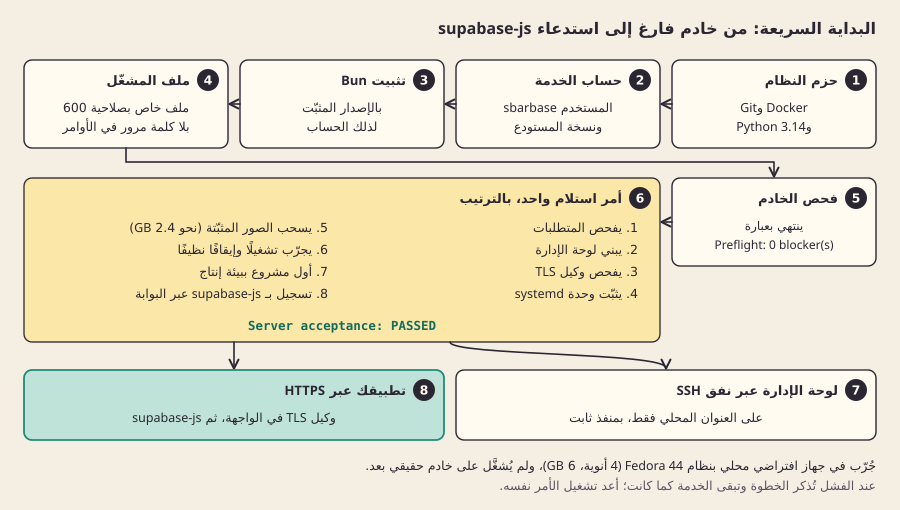

[English](quickstart.md)

# البداية السريعة

من خادم فارغ إلى استدعاء supabase-js على أول بيئة لك. هذه هي الخطوات التي نفّذتها تجربة كاملة على خادم فارغ، في آلة افتراضية نظيفة بنظام Fedora 44 فيها 4 أنوية معالج و6 GB من الذاكرة ([lab/vm-rehearsal.sh](../../lab/vm-rehearsal.sh)). لم تُشغَّل على خادم حقيقي بعد، وخطوة HTTPS في النهاية لم تُفحص إلا بشهادة موقّعة ذاتيًا. صباربيز قيد التطوير: لا تضع عليه بيانات لا تحتمل خسارتها.

إذا كان Docker موجودًا على الخادم، فإن [التثبيت عبر Docker](docker.ar.md) أقصر ولا يعتمد على إصدار Python في الخادم. هذه الصفحة هي مسار systemd.

قبل أن تبدأ، اقرأ [اختيار خادم](choosing-a-server.ar.md). تحتاج صلاحية root على خادم Fedora 44 أو Ubuntu 26.04 فيه 4 أنوية و8 GB من الذاكرة (3 أنوية هي الحد الأدنى المفيد) و12 GiB من القرص الفارغ. آلة التجربة ذات 6 GB اتسعت لبيئة واحدة بالضبط، وهي التي تنشئها الخطوة 6.



*المسار كله في نظرة واحدة، كما جُرّب في آلة افتراضية محلية؛ ولم يُشغَّل على خادم حقيقي بعد.*

## 1. ثبّت حزم النظام

على Fedora 44:

```bash
sudo dnf install -y moby-engine git python3-cryptography
sudo systemctl enable --now docker
```

مقابلاتها على Ubuntu 26.04 هي `docker.io` و`git` و`python3-cryptography`. تحقق أن `/usr/bin/python3 --version` يعطي 3.14 أو أحدث.

## 2. أنشئ حساب الخدمة ونسخة المستودع

يعمل صباربيز بحسابه الخاص، وهو صاحب نسخة المستودع تحت `/opt/sbarbase`:

```bash
sudo useradd -m -s /bin/bash sbarbase
sudo usermod -aG docker sbarbase
sudo install -d -o sbarbase -g sbarbase /opt/sbarbase
sudo -u sbarbase git clone https://github.com/M7MMAD-OMAR/sbarbase /opt/sbarbase
```

العضوية في مجموعة `docker` تعادل root على هذا الخادم؛ ويشرح [نموذج التهديد](../explain/threat-model.ar.md) لماذا نقبل ذلك حاليًا.

## 3. ثبّت Bun لذلك الحساب

```bash
sudo -u sbarbase -H bash -c 'curl -fsSL https://bun.sh/install | bash -s bun-v1.3.14'
```

نسخت التجربة الملف التنفيذي نفسه لـBun 1.3.14 إلى `/home/sbarbase/.bun/bin` بدلًا من ذلك؛ والمثبّت الرسمي يضعه في المكان نفسه.

## 4. اكتب بيانات اعتماد المشغّل الأول في ملف خاص

```bash
cd /opt/sbarbase
sudo -u sbarbase /usr/bin/python3 lab/operator_file.py /home/sbarbase/operator.json
```

يطلب بريدًا إلكترونيًا واسم عميل وكلمة مرور (مرتين، دون إظهارها، و12 حرفًا على الأقل)، ثم يكتب ملفًا بالوضع 600. لا تظهر كلمة المرور أبدًا في وسيط أو سجل أو في الأدلة.

## 5. افحص الخادم

```bash
sudo -u sbarbase /usr/bin/python3 lab/install_server.py check
```

يجب أن ينتهي بـ`Preflight: 0 blocker(s)`. كل عائق يذكر ما عليك إصلاحه، ومعه أرقام الذاكرة والأنوية الدقيقة التي يحتاجها.

## 6. ثبّت وجرّب وأنشئ أول مشروع بأمر واحد

```bash
sudo deploy/server-acceptance.sh --rehearse --install-unit --first-project \
     --service-user sbarbase --home /home/sbarbase --bun-dir /home/sbarbase/.bun/bin \
     --docker-host unix:///var/run/docker.sock --bootstrap-file /home/sbarbase/operator.json
```

يفعل بالترتيب ما يلي: يفحص المتطلبات، ويبني لوحة الإدارة، ويفحص وكيل TLS، ويثبّت خدمة systemd المسماة `sbarbase` ويشغّلها، ويسحب الصور المثبّتة الإصدار (نحو 2.4 GB، مع عرض التقدم)، ويجرّب تشغيلًا وإيقافًا نظيفًا، ثم يشغّل الخدمة من جديد. بعدها ينشئ مشروعًا اسمه "First project" فيه بيئة `production`، ويصدر مفتاحًا، ويسجّل مستخدمًا بـsupabase-js عبر البوابة، ثم يسحب المفتاح. ينتهي بـ`Server acceptance: PASSED`، وتُحفظ الأدلة في `docs/evidence/`. المشروع الأول حقيقي: يشغل واحدة من البيئات الأربع التي يسمح بها التثبيت حاليًا، ويترك في تلك البيئة مستخدم تطبيق واحدًا للاختبار.

عند الفشل يذكر الأمر الخطوة التي فشلت، ويترك الخدمة كما وجدها. أصلح السبب وشغّل الأمر نفسه مجددًا.

## 7. افتح لوحة الإدارة

تستمع لوحة الإدارة على الواجهة المحلية فقط. ثبّت منفذها ليبقى بعد إعادة التشغيل، ثم صِل إليها من حاسوبك عبر نفق SSH:

```bash
sudo mkdir -p /etc/systemd/system/sbarbase.service.d
printf '[Service]\nEnvironment=SBARBASE_CONSOLE_PORT=8787\n' | sudo tee /etc/systemd/system/sbarbase.service.d/console-port.conf
sudo systemctl daemon-reload && sudo systemctl restart sbarbase
```

```bash
ssh -L 8787:127.0.0.1:8787 you@your-server
```

افتح بعدها `http://localhost:8787` وادخل بالبريد وكلمة المرور من الخطوة 4. سترى عميلك و"First project" وبيئته `production`. أنشئ بيئة أخرى، وافتح تفاصيل الاتصال بها، وأصدر مفتاحًا: يظهر المفتاح مرة واحدة فقط.

## 8. استخدمه من تطبيقك

تعطيك تفاصيل الاتصال مسار البيئة، `/<runtime>`. وجّه supabase-js إلى عنوانك العام مضافًا إليه ذلك المسار:

```js
import {createClient} from '@supabase/supabase-js';
const supabase = createClient('https://console.example.com/<runtime>', '<publishable key>');
```

يعمل Auth وREST وStorage عبر هذا العنوان الواحد، من خادم أو من صفحة في المتصفح على أي نطاق. ويُشغَّل Realtime لكل بيئة ([Realtime](realtime.ar.md))، ويُضبط مزوّدو OAuth لكل بيئة ([تسجيل الدخول](sign-in.ar.md))، وتُنشر Edge Functions لكل بيئة من مجلد دوال Supabase ([Edge Functions](edge-functions.ar.md)).

للعنوان العام عبر HTTPS، ضع وكيل TLS المرجعي (أو nginx أو Caddy) أمام `127.0.0.1:8787` بشهادة حقيقية، كما يصف [دليل النشر على خادم](server-deployment.ar.md). لا تفتح في الجدار الناري إلا SSH و80 و443.

## ماذا بعد

- انسخ احتياطيًا: اقرأ [النسخ الاحتياطي والاستعادة](backup-and-restore.ar.md) لتعرف ما هو متاح اليوم وحدوده. النسخ الاحتياطية المجدولة خارج الخادم هي المرحلة التالية في [خارطة الطريق](../engineering/plans/2026-09-23-roadmap.md).
- افهم ما تتشاركه بيئاتك: [العزل والثقة](../explain/isolation-and-trust.ar.md).
- تحقق مما ثبت وما لم يثبت: [الحالة](../reference/status.ar.md).
