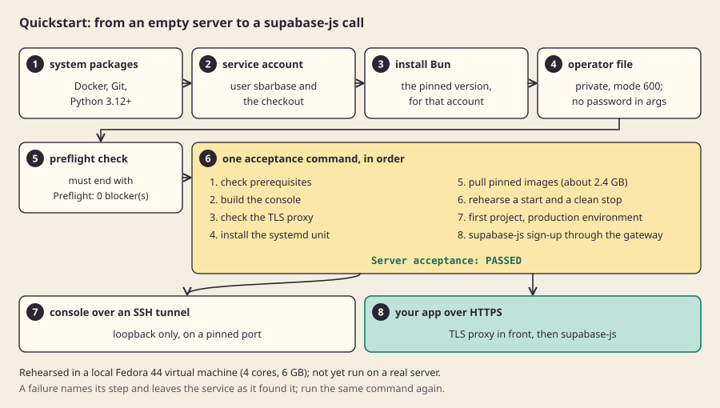

[العربية](quickstart.ar.md)

# Quickstart

From an empty server to a supabase-js call against your first environment. These are the steps an empty-server rehearsal ran, on a clean Fedora 44 virtual machine with 4 CPU cores and 6 GB of memory ([lab/vm-rehearsal.sh](../../lab/vm-rehearsal.sh)). It has not been run on a real server yet, and the HTTPS step at the end has only been checked with a self-signed certificate. Sbarbase is in development: do not put data you cannot lose on it.

With Docker on the server, [Install with Docker](docker.md) is shorter and does not depend on the host's Python. This page is the systemd path.

Before you start, read [choosing a server](choosing-a-server.md). You need root on a Fedora 44 or Ubuntu 26.04 server with 4 cores and 8 GB of memory (3 cores is the useful minimum) and 12 GiB of free disk. The rehearsal's 6 GB machine had room for exactly one environment, the one step 6 creates.



*The whole path at a glance, as rehearsed in a local virtual machine; not yet run on a real server.*

## 1. Install the system packages

On Fedora 44:

```bash
sudo dnf install -y moby-engine git python3-cryptography
sudo systemctl enable --now docker
```

On Ubuntu 26.04 the equivalents are `docker.io`, `git` and `python3-cryptography`. Check that `/usr/bin/python3 --version` says 3.14 or newer.

## 2. Create the service account and the checkout

Sbarbase runs as its own account, which holds the checkout under `/opt/sbarbase`:

```bash
sudo useradd -m -s /bin/bash sbarbase
sudo usermod -aG docker sbarbase
sudo install -d -o sbarbase -g sbarbase /opt/sbarbase
sudo -u sbarbase git clone https://github.com/M7MMAD-OMAR/sbarbase /opt/sbarbase
```

Membership of the `docker` group is equivalent to root on this host; the [threat model](../explain/threat-model.md) explains why that is accepted for now.

## 3. Install Bun for that account

```bash
sudo -u sbarbase -H bash -c 'curl -fsSL https://bun.sh/install | bash -s bun-v1.3.14'
```

The rehearsal copied the same Bun 1.3.14 binary into `/home/sbarbase/.bun/bin` instead; the official installer puts it in the same place.

## 4. Write the first operator's credentials to a private file

```bash
cd /opt/sbarbase
sudo -u sbarbase /usr/bin/python3 lab/operator_file.py /home/sbarbase/operator.json
```

It asks for an email, a client name and a password (twice, not echoed, at least 12 characters) and writes a mode 600 file. The password never appears in an argument, a log or the evidence.

## 5. Check the server

```bash
sudo -u sbarbase /usr/bin/python3 lab/install_server.py check
```

It must end with `Preflight: 0 blocker(s)`. Each blocker says what to fix, including the exact memory and core figures it needs.

## 6. Install, rehearse and create your first project in one command

```bash
sudo deploy/server-acceptance.sh --rehearse --install-unit --first-project \
     --service-user sbarbase --home /home/sbarbase --bun-dir /home/sbarbase/.bun/bin \
     --docker-host unix:///var/run/docker.sock --bootstrap-file /home/sbarbase/operator.json
```

In order, it checks the prerequisites, builds the console, checks the TLS proxy, installs and starts the `sbarbase` systemd service, pulls the pinned images (about 2.4 GB, with progress), rehearses a start and a clean stop, starts the service again, then creates a project called "First project" with a `production` environment, issues a key, signs a user up with supabase-js through the gateway and revokes the key. It ends with `Server acceptance: PASSED`. Evidence lands in `docs/evidence/`. The first project is real: it uses one of the four environments an installation allows for now, and it leaves one test application user in that environment.

A failure names the step and leaves the service as it found it. Fix the cause and run the same command again.

## 7. Open the console

The console listens on loopback only. Pin its port so it survives restarts, then reach it through an SSH tunnel from your own computer:

```bash
sudo mkdir -p /etc/systemd/system/sbarbase.service.d
printf '[Service]\nEnvironment=SBARBASE_CONSOLE_PORT=8787\n' | sudo tee /etc/systemd/system/sbarbase.service.d/console-port.conf
sudo systemctl daemon-reload && sudo systemctl restart sbarbase
```

```bash
ssh -L 8787:127.0.0.1:8787 you@your-server
```

Then open `http://localhost:8787` and log in with the operator email and password from step 4. You will see your client, "First project" and its `production` environment. Create another environment, open its connection details and issue a key: the key is shown once.

## 8. Use it from your application

The connection details give the environment's path, `/<runtime>`. Point supabase-js at your public address plus that path:

```js
import {createClient} from '@supabase/supabase-js';
const supabase = createClient('https://console.example.com/<runtime>', '<publishable key>');
```

Auth, REST and Storage work through that one address, from a server or from a browser page on any domain. Realtime is turned on per environment ([Realtime](realtime.md)) and OAuth providers are set per environment ([sign-in](sign-in.md)); Edge Functions are not routed yet ([API reference](../reference/api.md)).

For the public HTTPS address, put the reference TLS proxy (or nginx or Caddy) in front of `127.0.0.1:8787` with a real certificate, as the [server deployment runbook](server-deployment.md) describes. Open only SSH, 80 and 443 in the firewall.

## What to do next

- Back up: read [backup and restore](backup-and-restore.md) for what exists today, and its limits. Scheduled, off-host backups are the next milestone on the [roadmap](../engineering/plans/2026-09-23-roadmap.md).
- Understand what is shared between your environments: [isolation and trust](../explain/isolation-and-trust.md).
- Check what is proven and what is not: [status](../reference/status.md).
